### **Lecture 1: Introduction to Matplotlib**

#### **What is Matplotlib?**
Matplotlib is a Python library used to create static, animated, and interactive visualizations in Python. It’s widely used for plotting graphs and charts.<br>
Matplotlib was created by John D. Hunter.<br>
Matplotlib is open source and we can use it freely.<br>
Matplotlib is mostly written in python, a few segments are written in C, Objective-C and Javascript for Platform compatibility.

**`Installation of Matplotlib`**<br>
If you have Python and PIP already installed on a system, then installation of Matplotlib is very easy.<br>
Install it using this command:

**`pip install matplotlib`** or **`py -m pip install matplotlib`**


#### **Program 1: Basic Line Plot**
**Real-World Scenario:** You want to visualize the sales growth over the first 6 months of the year.


```python
import matplotlib.pyplot as plt

# Sales data for the first 6 months
months = ['January', 'February', 'March', 'April', 'May', 'June']
sales = [200, 220, 240, 260, 280, 300]

# Create a line plot to show sales growth
plt.plot(months, sales, marker='o')
plt.title('Sales Growth (January - June)')
plt.xlabel('Months')
plt.ylabel('Sales (in $)')
plt.grid(True)
plt.show()
```


    
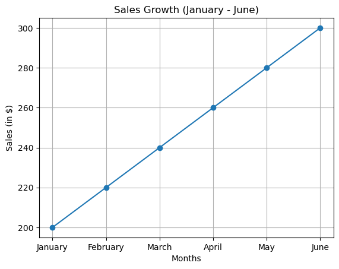
    


#### **Program 2: Bar Chart for Product Sales**
**Real-World Scenario:** You want to compare the sales of 5 products in the last month.


```python
import matplotlib.pyplot as plt  # Importing the library for plotting

# Product sales data
products = ['Product A', 'Product B', 'Product C', 'Product D', 'Product E']  # List of product names
sales = [100, 150, 200, 250, 300]  # Corresponding sales numbers for each product

# Create a bar chart to compare sales
plt.bar(products, sales, color='orange')  # Creates a bar chart with products on the x-axis and sales on the y-axis
plt.title('Product Sales for Last Month')  # Adds a title to the chart
plt.xlabel('Products')  # Labels the x-axis
plt.ylabel('Sales')  # Labels the y-axis
plt.show()  # Displays the chart
```


    
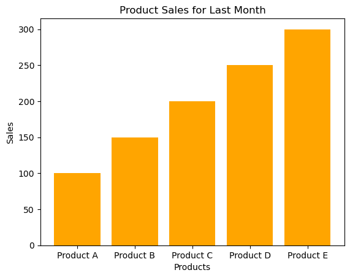
    


#### **Program 3: Scatter Plot for Marketing Spend vs Sales**
**Real-World Scenario:** You want to see the relationship between marketing spend and sales.


```python
import matplotlib.pyplot as plt  # Importing the library

# Marketing spend and sales data
marketing_spend = [1000, 2000, 3000, 4000, 5000]  # Marketing budget values
sales = [1500, 2500, 3500, 4500, 5500]  # Corresponding sales data

# Create a scatter plot
plt.scatter(marketing_spend, sales, color='blue')  # Creates a scatter plot where x is marketing spend and y is sales
plt.title('Marketing Spend vs Sales')  # Adds a title
plt.xlabel('Marketing Spend ($)')  # Labels the x-axis
plt.ylabel('Sales ($)')  # Labels the y-axis
plt.show()  # Displays the chart
```


    

    


#### **Program 4: Pie Chart for Market Share**
**Real-World Scenario:** You want to show the market share of 4 companies in a pie chart.
```python


```python
import matplotlib.pyplot as plt  # Importing the library

# Market share data
companies = ['Company A', 'Company B', 'Company C', 'Company D']  # List of companies
market_share = [40, 25, 20, 15]  # Market share percentage for each company

# Create a pie chart
plt.pie(market_share, labels=companies, autopct='%1.1f%%', startangle=90)  # Pie chart with percentage labels and a starting angle
plt.title('Market Share Distribution')  # Title for the chart
plt.show()  # Display the chart
```


    

    


#### **Program 5: Real-World Scenario – Monthly Sales Trend**


```python
import matplotlib.pyplot as plt  # Importing the library

# Monthly sales data
months = ['Jan', 'Feb', 'Mar', 'Apr', 'May', 'Jun']  # List of months
sales = [500, 600, 700, 800, 850, 900]  # Sales values for each month

# Create a line plot for monthly sales trend
plt.plot(months, sales, marker='o', color='green')  # Creates a line plot with markers and green color
plt.title('Monthly Sales Growth')  # Adds a title
plt.xlabel('Month')  # Labels the x-axis
plt.ylabel('Sales ($)')  # Labels the y-axis
plt.show()  # Displays the chart

```


    
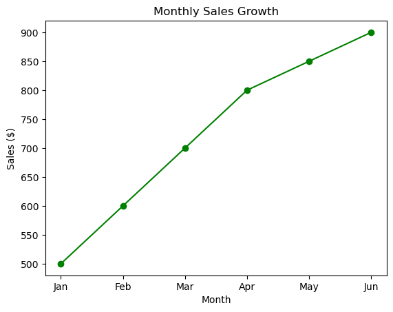
    


---

### **Lecture 2: Customizing Plots**

#### **Program 1: Adding Titles and Labels**


```python
import matplotlib.pyplot as plt  # Importing the library

# Sales data
months = ['Jan', 'Feb', 'Mar', 'Apr', 'May', 'Jun']  # List of months
sales = [200, 300, 400, 500, 600, 700]  # Sales data for each month

# Line plot with custom title and axis labels
plt.plot(months, sales, marker='o', color='red')  # Line plot with markers and red color
plt.title('Monthly Sales Growth', fontsize=14)  # Adds a title with font size 14
plt.xlabel('Months', fontsize=12)  # Labels the x-axis with font size 12
plt.ylabel('Sales ($)', fontsize=12)  # Labels the y-axis with font size 12
plt.show()  # Displays the chart

```


    

    


#### **Program 2: Adding Gridlines**


```python
import matplotlib.pyplot as plt  # Importing the library

# Product sales data
products = ['A', 'B', 'C', 'D']  # List of products
sales = [300, 450, 550, 600]  # Sales data for each product

# Bar chart with gridlines
plt.bar(products, sales, color='purple')  # Bar chart with purple color
plt.title('Product Sales Comparison')  # Title for the chart
plt.xlabel('Products')  # Labels the x-axis
plt.ylabel('Sales')  # Labels the y-axis
plt.grid(True, which='both')  # Adds gridlines for both axes
plt.show()  # Displays the chart

```


    
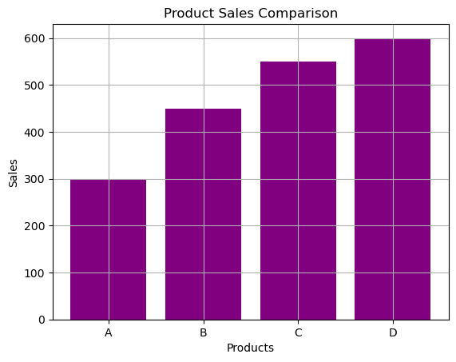
    


#### **Program 3: Changing Line Style and Color**


```python
import matplotlib.pyplot as plt  # Importing the library

# Sales data
months = ['Jan', 'Feb', 'Mar', 'Apr', 'May']  # List of months
sales = [100, 200, 300, 400, 500]  # Sales data for each month

# Customizing line style and color
plt.plot(months, sales, linestyle='--', color='orange', marker='x')  # Dashed line, orange color, and x markers
plt.title('Sales Trend')  # Title for the chart
plt.xlabel('Months')  # Labels the x-axis
plt.ylabel('Sales ($)')  # Labels the y-axis
plt.show()  # Displays the chart

```


    

    


#### **Program 4: Adding Legends to a Plot**


```python
import matplotlib.pyplot as plt  # Importing the library

# Sales data for two products
product_a = [10, 20, 30, 40]  # Sales data for Product A
product_b = [40, 30, 20, 10]  # Sales data for Product B

# Plot with legends
plt.plot(product_a, label='Product A', color='blue')  # Plotting Product A with a label and blue color
plt.plot(product_b, label='Product B', color='green')  # Plotting Product B with a label and green color
plt.title('Sales Trend Comparison')  # Title for the chart
plt.xlabel('Months')  # Labels the x-axis
plt.ylabel('Sales')  # Labels the y-axis
plt.legend(loc='best')  # Displays the legend in the best position
plt.show()  # Displays the chart

```


    
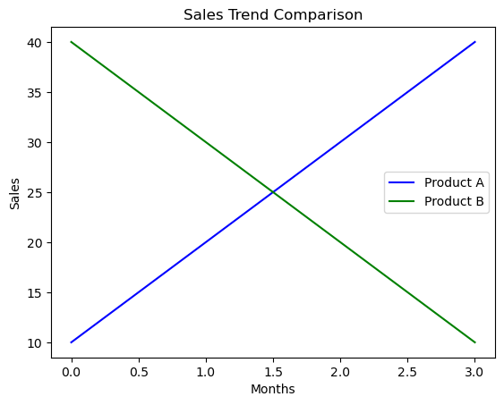
    


#### **Program 5: Real-World Scenario – Customize Sales Growth Plot**


```python
import matplotlib.pyplot as plt  # Importing the library

# Monthly sales data
months = ['Jan', 'Feb', 'Mar', 'Apr', 'May']  # List of months
sales = [500, 700, 900, 1100, 1300]  # Sales data for each month

# Line plot with customization
plt.plot(months, sales, marker='o', color='green')  # Line plot with markers and green color
plt.title('Sales Growth Over 5 Months', fontsize=16)  # Adds a title with font size 16
plt.xlabel('Months', fontsize=14)  # Labels the x-axis with font size 14
plt.ylabel('Sales in Dollars', fontsize=14)  # Labels the y-axis with font size 14
plt.grid(True)  # Adds gridlines
plt.show()  # Displays the chart

```


    
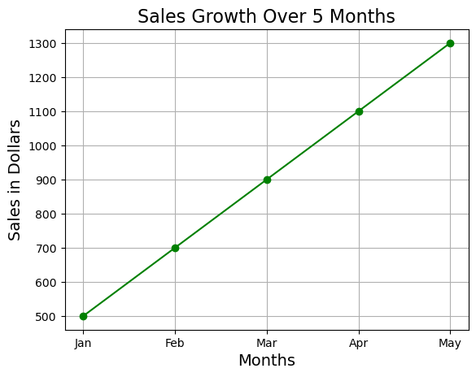
    


---

### **Lecture 3: Subplots and Multi-Plot Layouts**

#### **Program 1: Creating Two Subplots**


```python
import matplotlib.pyplot as plt  # Importing the library

# Data
months = ['Jan', 'Feb', 'Mar', 'Apr']  # List of months
sales = [100, 200, 300, 400]  # Sales data for each month
profits = [50, 100, 150, 200]  # Profits data for each month

# Create subplots (1 row, 2 columns)
fig, (ax1, ax2) = plt.subplots(1, 2)  # Creates a figure with two subplots

# First subplot (for sales)
ax1.plot(months, sales, color='blue')  # Line plot for sales with blue color
ax1.set_title('Sales Over Months')  # Title for the first plot
ax1.set_xlabel('Months')  # Labels the x-axis of the first plot
ax1.set_ylabel('Sales ($)')  # Labels the y-axis of the first plot

# Second subplot (for profits)
ax2.plot(months, profits, color='green')  # Line plot for profits with green color
ax2.set_title('Profits Over Months')  # Title for the second plot
ax2.set_xlabel('Months')  # Labels the x-axis of the second plot
ax2.set_ylabel('Profits ($)')  # Labels the y-axis of the second plot

plt.tight_layout()  # Adjusts the spacing between subplots
plt.show()  # Displays the plots

```


    

    


#### **Program 2: Creating a Grid of Subplots**


```python
import matplotlib.pyplot as plt  # Importing the library

# Data
months = ['Jan', 'Feb', 'Mar', 'Apr']  # List of months
sales = [100, 200, 300, 400]  # Sales data for each month
profits = [50, 100, 150, 200]  # Profits data for each month
expenses = [30, 60, 90, 120]  # Expenses data for each month

# Create a 2x2 grid of subplots
fig, axes = plt.subplots(2, 2)  # Creates a figure with a 2x2 grid of subplots

# Plotting each subplot
axes[0, 0].plot(months, sales, color='blue')  # First subplot (top-left) for sales
axes[0, 0].set_title('Sales')  # Title for the first subplot

axes[0, 1].plot(months, profits, color='green')  # Second subplot (top-right) for profits
axes[0, 1].set_title('Profits')  # Title for the second subplot

axes[1, 0].plot(months, expenses, color='red')  # Third subplot (bottom-left) for expenses
axes[1, 0].set_title('Expenses')  # Title for the third subplot

axes[1, 1].plot(months, sales, color='orange')  # Fourth subplot (bottom-right) for sales growth
axes[1, 1].set_title('Sales Growth')  # Title for the fourth subplot

plt.tight_layout()  # Adjusts the spacing between subplots
plt.show()  # Displays the plots

```


    

    


#### **Program 3: Real-World Scenario – Multiple Business Metrics**


```python
import matplotlib.pyplot as plt  # Importing the library

# Data
months = ['Jan', 'Feb', 'Mar', 'Apr']  # List of months
sales = [1200, 1500, 1700, 1800]  # Sales data for each month
profit = [500, 600, 650, 700]  # Profit data for each month
expense = [200, 300, 400, 500]  # Expense data for each month

# Subplots for business metrics
fig, (ax1, ax2) = plt.subplots(1, 2)  # Creates a figure with two subplots (side by side)

# First subplot (for sales and profit)
ax1.plot(months, sales, color='blue', label='Sales')  # Line plot for sales with blue color
ax1.plot(months, profit, color='green', label='Profit')  # Line plot for profit with green color
ax1.set_title('Sales & Profit')  # Title for the first subplot
ax1.set_xlabel('Months')  # Labels the x-axis of the first subplot
ax1.set_ylabel('Amount ($)')  # Labels the y-axis of the first subplot
ax1.legend()  # Adds a legend to the first subplot

# Second subplot (for expense trend)
ax2.plot(months, expense, color='red', label='Expense')  # Line plot for expense with red color
ax2.set_title('Expense Trend')  # Title for the second subplot
ax2.set_xlabel('Months')  # Labels the x-axis of the second subplot
ax2.set_ylabel('Amount ($)')  # Labels the y-axis of the second subplot
ax2.legend()  # Adds a legend to the second subplot

plt.tight_layout()  # Adjusts the spacing between subplots
plt.show()  # Displays the plots

```


    

    


---

### **Lecture 4: Data Visualization with Seaborn**

#### **Program 1: Bar Plot with Seaborn**


```python
import seaborn as sns  # Importing Seaborn for advanced visualizations
import matplotlib.pyplot as plt  # Importing Matplotlib for showing the plot

# Sales data
products = ['Product A', 'Product B', 'Product C']  # List of products
sales = [500, 600, 700]  # Sales values for each product

# Create a seaborn bar plot
sns.barplot(x=products, y=sales)  # Bar plot with products on the x-axis and sales on the y-axis
plt.title('Sales by Product')  # Adds a title
plt.show()  # Displays the plot

```


    

    


#### **Program 2: Boxplot for Distribution of Data**


```python
import seaborn as sns  # Importing Seaborn for advanced visualizations
import matplotlib.pyplot as plt  # Importing Matplotlib for showing the plot

# Random data for product sales in different regions
region_sales = sns.load_dataset('tips')  # Loading a sample dataset from Seaborn

# Create a boxplot
sns.boxplot(x='day', y='total_bill', data=region_sales)  # Creates a boxplot for total bill by day of the week
plt.title('Boxplot of Total Bill by Day')  # Adds a title
plt.show()  # Displays the plot

```


    
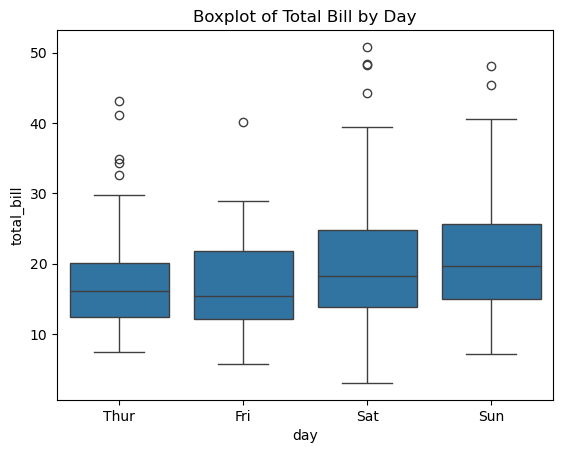
    


#### **Program 3: Heatmap for Correlation Matrix**


```python
import seaborn as sns  # Importing Seaborn for advanced visualizations
import matplotlib.pyplot as plt  # Importing Matplotlib for showing the plot
import pandas as pd  # Importing pandas for data manipulation

# Correlation data for sales, expenses, and profits
data = {
    'Sales': [100, 200, 300, 400, 500],
    'Expenses': [50, 100, 150, 200, 250],
    'Profit': [50, 100, 150, 200, 250]
}
df = pd.DataFrame(data)  # Creating a DataFrame from the data

# Create a heatmap to visualize correlations
sns.heatmap(df.corr(), annot=True, cmap='coolwarm')  # Correlation heatmap with annotations
plt.title('Heatmap of Sales, Expenses, and Profit Correlation')  # Adds a title
plt.show()  # Displays the plot

```


    

    


#### **Program 4: Pairplot to Visualize Relationships**


```python
import seaborn as sns  # Importing Seaborn for advanced visualizations
import matplotlib.pyplot as plt  # Importing Matplotlib for showing the plot

# Tips dataset for pairplot
tips = sns.load_dataset('tips')  # Loading a sample dataset from Seaborn
# print(tips)
print(tips.head())  # Show the first 5 rows
print(tips.info())  # Get column details (data types, missing values)
print(tips.describe())  # Get statistical summary (mean, min, max, etc.)

# Create a pairplot to show relationships between different attributes
# sns.pairplot(tips)  # Pairplot showing relationships between all pairs of features in the dataset
sns.pairplot(tips, hue='sex', diag_kind='kde')  # Different colors for male & female, KDE histograms
# What is a Pairplot?
# Pairplot creates scatter plots between every pair of numeric columns in the dataset.
# It helps visualize correlations and distributions of data.
# The diagonal of the plot shows a histogram (distribution) of each numeric column.
plt.show()  # Displays the plot

```

       total_bill   tip     sex smoker  day    time  size
    0       16.99  1.01  Female     No  Sun  Dinner     2
    1       10.34  1.66    Male     No  Sun  Dinner     3
    2       21.01  3.50    Male     No  Sun  Dinner     3
    3       23.68  3.31    Male     No  Sun  Dinner     2
    4       24.59  3.61  Female     No  Sun  Dinner     4
    <class 'pandas.core.frame.DataFrame'>
    RangeIndex: 244 entries, 0 to 243
    Data columns (total 7 columns):
     #   Column      Non-Null Count  Dtype   
    ---  ------      --------------  -----   
     0   total_bill  244 non-null    float64 
     1   tip         244 non-null    float64 
     2   sex         244 non-null    category
     3   smoker      244 non-null    category
     4   day         244 non-null    category
     5   time        244 non-null    category
     6   size        244 non-null    int64   
    dtypes: category(4), float64(2), int64(1)
    memory usage: 7.4 KB
    None
           total_bill         tip        size
    count  244.000000  244.000000  244.000000
    mean    19.785943    2.998279    2.569672
    std      8.902412    1.383638    0.951100
    min      3.070000    1.000000    1.000000
    25%     13.347500    2.000000    2.000000
    50%     17.795000    2.900000    2.000000
    75%     24.127500    3.562500    3.000000
    max     50.810000   10.000000    6.000000
    


    
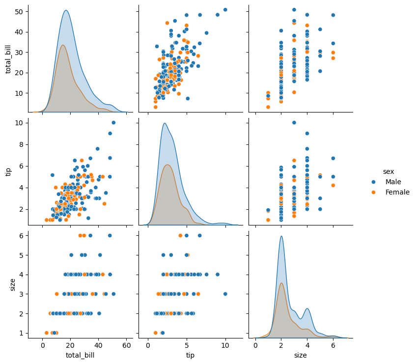
    


#### **Program 5: Real-World Scenario – Product Performance across Regions**


```python
# import seaborn as sns  # Importing Seaborn for advanced visualizations
import matplotlib.pyplot as plt  # Importing Matplotlib for showing the plot

# Sales data by region
sales_data = sns.load_dataset('tips')  # Loading a sample dataset from Seaborn

# Create a heatmap to visualize product sales across different regions
sns.heatmap(sales_data.pivot_table(index='sex', columns='day', values='total_bill', aggfunc='mean'))  # Pivot table heatmap
plt.title('Product Performance by Region (Average Bill)')  # Adds a title
plt.show()  # Displays the plot
```

    C:\Users\mrahe\AppData\Local\Temp\ipykernel_18008\1319488211.py:8: FutureWarning: The default value of observed=False is deprecated and will change to observed=True in a future version of pandas. Specify observed=False to silence this warning and retain the current behavior
      sns.heatmap(sales_data.pivot_table(index='sex', columns='day', values='total_bill', aggfunc='mean'))  # Pivot table heatmap
    


    
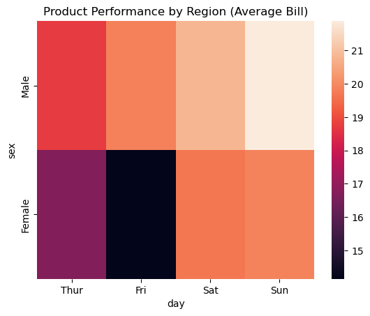
    


---

### **Lecture 5: Regression and Distribution Plots**

#### **Program 1: Scatter Plot with Regression Line**


```python
import seaborn as sns  # Import Seaborn for visualization
import matplotlib.pyplot as plt  # Import Matplotlib for displaying the plot
import pandas as pd  # Import Pandas for DataFrame creation

# Data for pricing vs sales
data = pd.DataFrame({  # Convert dictionary to a Pandas DataFrame
    'Price': [10, 20, 30, 40, 50],
    'Sales': [100, 200, 300, 400, 500]
})

# Create a regression plot
sns.regplot(x='Price', y='Sales', data=data)  # Scatter plot with a regression line
plt.title('Regression Plot: Price vs Sales')  # Adds a title
plt.show()  # Displays the plot

```


    
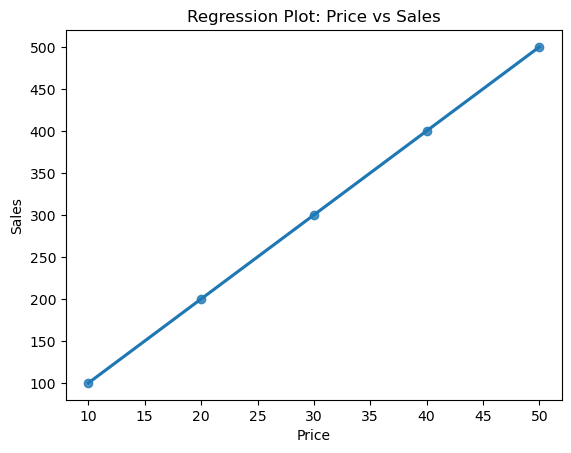
    


#### **Program 2: Visualizing the Distribution of a Dataset**


```python
import seaborn as sns  # Importing Seaborn for advanced visualizations
import matplotlib.pyplot as plt  # Importing Matplotlib for showing the plot

# Random data for product sales
data = [100, 150, 200, 250, 300, 350, 400, 450]  # Sales data

# Create a histogram to visualize the distribution
sns.histplot(data, kde=True)  # Histogram with a Kernel Density Estimation (KDE) curve
plt.title('Sales Distribution')  # Adds a title
plt.show()  # Displays the plot

```


    
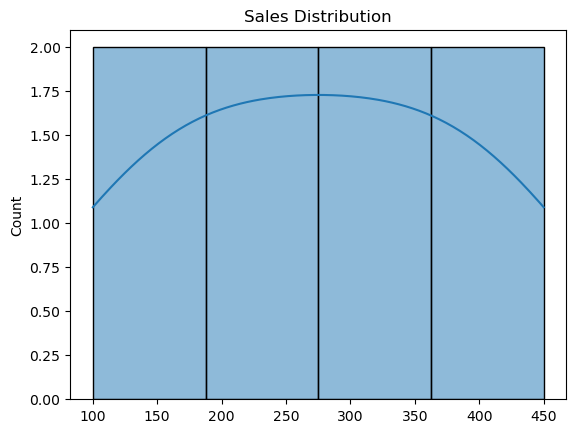
    


#### **Program 3: Real-World Scenario – Product Pricing and Sales**


```python
import seaborn as sns  # Importing Seaborn for advanced visualizations
import matplotlib.pyplot as plt  # Importing Matplotlib for showing the plot

# Data: Product pricing and sales
prices = [10, 15, 20, 25, 30]
sales = [100, 200, 250, 350, 500]

# Regression plot to show how price affects sales
sns.regplot(x=prices, y=sales)  # Scatter plot with a regression line
plt.title('Product Pricing vs Sales')  # Adds a title
plt.show()  # Displays the plot

```


    
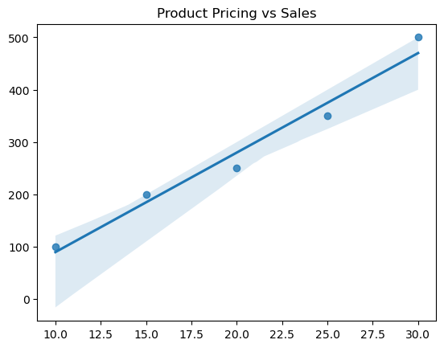
    


#### **Program 4: Creating a KDE Plot for Distribution**


```python
# import seaborn as sns  # Importing Seaborn for advanced visualizations
# import matplotlib.pyplot as plt  # Importing Matplotlib for showing the plot

# # Random data for product ratings
# ratings = [1, 2, 3, 4, 5, 5, 4, 3, 4, 5]  # Product ratings

# # Create a Kernel Density Estimation plot
# sns.kdeplot(ratings, shade=True)  # KDE plot with shaded area
# plt.title('Product Ratings Distribution')  # Adds a title
# plt.show()  # Displays the plot

import seaborn as sns  # Import Seaborn for visualization
import matplotlib.pyplot as plt  # Import Matplotlib for displaying the plot

# Random data for product ratings
ratings = [1, 2, 3, 4, 5, 5, 4, 3, 4, 5]  # Product ratings

# Create a Kernel Density Estimation (KDE) plot
sns.kdeplot(ratings, fill=True)  # Use 'fill=True' instead of 'shade=True'
plt.title('Product Ratings Distribution')  # Adds a title
plt.show()  # Displays the plot

```


    
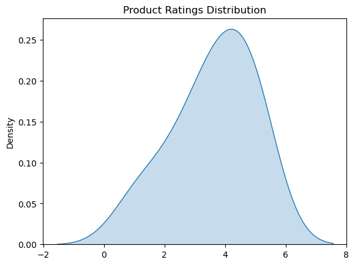
    


#### **Program 5: Real-World Scenario – Forecast Sales Using Regression**


```python
import seaborn as sns  # Importing Seaborn for advanced visualizations
import matplotlib.pyplot as plt  # Importing Matplotlib for showing the plot

# Data: Product pricing and sales numbers
pricing = [100, 200, 300, 400, 500]
sales = [1000, 1200, 1400, 1600, 1800]

# Plot regression for price vs sales data
sns.regplot(x=pricing, y=sales)  # Scatter plot with a regression line
plt.title('Sales Forecasting Based on Product Pricing')  # Adds a title
plt.show()  # Displays the plot

```


    
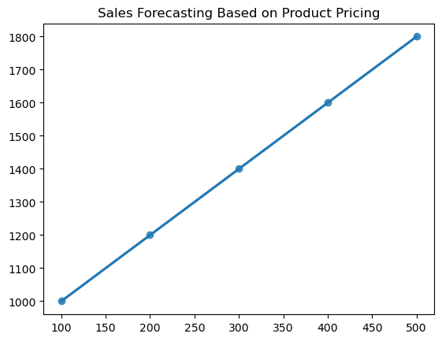
    


---

### **Lecture 6: Customizing Plots and Advanced Features**

#### **Program 1: Customizing Plot Colors and Styles**


```python
import matplotlib.pyplot as plt  # Importing the library for plotting

# Sales data for the first 6 months
months = ['Jan', 'Feb', 'Mar', 'Apr', 'May', 'Jun']  # List of months
sales = [200, 220, 250, 270, 300, 350]  # Sales data for each month

# Create a customized line plot with color and style
plt.plot(months, sales, color='blue', linestyle='-', marker='o', markersize=8)  # Customizes the line (blue color, solid line, circular markers)
plt.title('Sales Growth Over 6 Months', fontsize=14)  # Adds a title with font size 14
plt.xlabel('Month', fontsize=12)  # Labels the x-axis with font size 12
plt.ylabel('Sales ($)', fontsize=12)  # Labels the y-axis with font size 12
plt.grid(True)  # Adds gridlines to the plot
plt.show()  # Displays the plot

```


    

    


#### **Program 2: Adding Annotations to Plots**


```python
import matplotlib.pyplot as plt  # Importing the library

# Sales data with a peak in April
months = ['Jan', 'Feb', 'Mar', 'Apr', 'May', 'Jun']  # List of months
sales = [200, 220, 250, 270, 300, 350]  # Sales data for each month

# plt.plot(range(len(months)), sales, marker='o')  
# plt.xticks(range(len(months)), months)  # Assign month labels back
# plt.annotate('Peak in April', xy=(3, 270), xytext=(1, 240),  
#              arrowprops=dict(facecolor='red', shrink=0.05))

# Create the plot
plt.plot(months, sales, marker='o')  # Line plot with circular markers
# Annotating the peak in April
plt.annotate('Peak in April', xy=('Apr', 270), xytext=('Feb', 240),arrowprops=dict(facecolor='red', shrink=0.05))
# 'Peak in April' → The text to display.
# xy=('Apr', 270) → Point to annotate (April, sales = 270).
# xytext=('Feb', 240) → Position of the text annotation (February, sales = 240).
# arrowprops=dict(facecolor='red', shrink=0.05) → Red arrow pointing to the peak in April.

plt.title('Sales Growth with Annotations')  # Adds a title to the plot
plt.xlabel('Month')  # Labels the x-axis
plt.ylabel('Sales ($)')  # Labels the y-axis
plt.show()  # Displays the plot

```


    
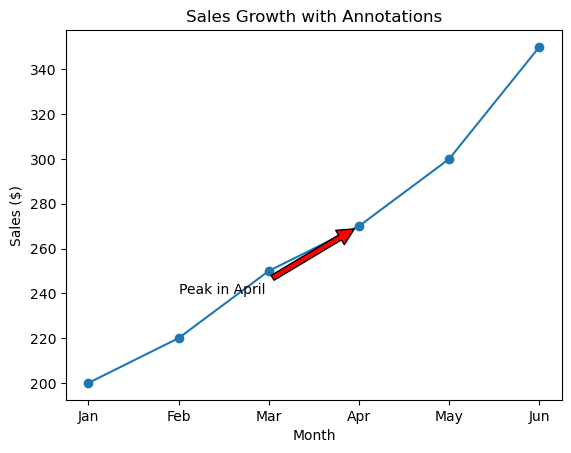
    


#### **Program 3: Adjusting the X and Y Axis Limits**


```python
import matplotlib.pyplot as plt  # Importing the library

# Sales data
months = ['Jan', 'Feb', 'Mar', 'Apr', 'May', 'Jun']  # List of months
sales = [200, 220, 250, 270, 300, 350]  # Sales data for each month

# Create the plot
plt.plot(months, sales, marker='o')  # Line plot with circular markers

# Set custom limits for the x and y axis
plt.xlim(0, 5)  # Focus on first 5 months (Jan to May)
plt.ylim(200, 350)  # Focus on sales between $200 and $350

plt.title('Zoomed-in View of Sales Growth')  # Adds a title
plt.xlabel('Month')  # Labels the x-axis
plt.ylabel('Sales ($)')  # Labels the y-axis
plt.show()  # Displays the plot

```


    

    


#### **Program 4: Adding a Horizontal Line**


```python
import matplotlib.pyplot as plt  # Importing the library

# Sales data
months = ['Jan', 'Feb', 'Mar', 'Apr', 'May', 'Jun']  # List of months
sales = [200, 220, 250, 270, 300, 350]  # Sales data for each month

# Create the plot
plt.plot(months, sales, marker='o')  # Line plot with circular markers

# Add a horizontal line for the sales target
plt.axhline(y=300, color='red', linestyle='--', label='Sales Target')  # Red dashed line at y=300

plt.title('Sales Growth with Target Line')  # Adds a title
plt.xlabel('Month')  # Labels the x-axis
plt.ylabel('Sales ($)')  # Labels the y-axis
plt.legend()  # Adds a legend for the target line
plt.show()  # Displays the plot

```


    

    


#### **Program 5: Real-World Scenario – Plotting Multiple Line Charts**


```python
import matplotlib.pyplot as plt  # Importing the library

# Sales data for 2 products
months = ['Jan', 'Feb', 'Mar', 'Apr', 'May', 'Jun']  # List of months
product_a_sales = [200, 220, 240, 260, 280, 300]  # Sales data for Product A
product_b_sales = [150, 180, 210, 250, 290, 320]  # Sales data for Product B

# Plot both products on the same graph
plt.plot(months, product_a_sales, marker='o', label='Product A')  # Plotting Product A with blue color and markers
plt.plot(months, product_b_sales, marker='o', label='Product B')  # Plotting Product B with green color and markers

plt.title('Sales Growth Comparison')  # Adds a title
plt.xlabel('Month')  # Labels the x-axis
plt.ylabel('Sales ($)')  # Labels the y-axis
plt.legend()  # Adds a legend to differentiate between Product A and Product B
plt.show()  # Displays the plot

```


    

    


---

### **Lecture 7: Advanced Plotting Techniques with Seaborn**

#### **Program 1: Creating a Heatmap**


```python
import seaborn as sns  # Importing Seaborn for advanced plotting
import matplotlib.pyplot as plt  # Importing Matplotlib for displaying the plot
import numpy as np  # Importing NumPy for creating random data

# Random data representing sales performance across 5 regions and 6 months
data = np.random.rand(5, 6)  # Creates a 5x6 array of random numbers between 0 and 1

# Create a heatmap
sns.heatmap(data, annot=True, cmap='Blues', xticklabels=['Jan', 'Feb', 'Mar', 'Apr', 'May', 'Jun'], yticklabels=['Region 1', 'Region 2', 'Region 3', 'Region 4', 'Region 5'])  # Heatmap with color scale
plt.title('Sales Performance Heatmap')  # Adds a title
plt.show()  # Displays the plot

```


    
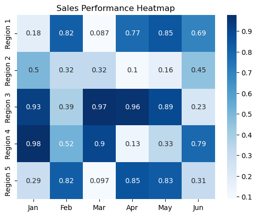
    


#### **Program 2: Boxplot for Distribution of Sales**


```python
import seaborn as sns  # Importing Seaborn for advanced plotting
import matplotlib.pyplot as plt  # Importing Matplotlib for displaying the plot

# Sales data for 4 products across 6 months
data = {
    'Product': ['A', 'A', 'A', 'A', 'B', 'B', 'B', 'B', 'C', 'C', 'C', 'C'],
    'Sales': [200, 220, 240, 250, 300, 350, 380, 390, 150, 160, 180, 190]
}

# Create a boxplot to show sales distribution
sns.boxplot(x='Product', y='Sales', data=data)  # Boxplot comparing sales across different products
plt.title('Sales Distribution for Different Products')  # Adds a title
plt.show()  # Displays the plot

```


    
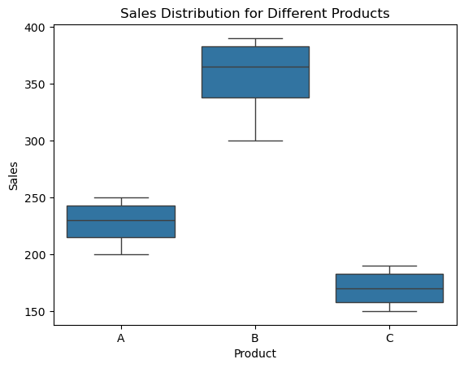
    


#### **Program 3: Pairplot to Visualize Relationships**


```python
import seaborn as sns  # Importing Seaborn for advanced plotting
import matplotlib.pyplot as plt  # Importing Matplotlib for displaying the plot
import pandas as pd

# Sample dataset for pairplot
data = pd.DataFrame({
    'Price': [10, 20, 30, 40, 50],
    'Marketing Spend': [1000, 1500, 2000, 2500, 3000],
    'Sales': [100, 200, 300, 400, 500]
})

# Create a pairplot
sns.pairplot(data)  # Creates a pairplot to show relationships between all pairs of features in the dataset
plt.show()  # Displays the plot

```


    
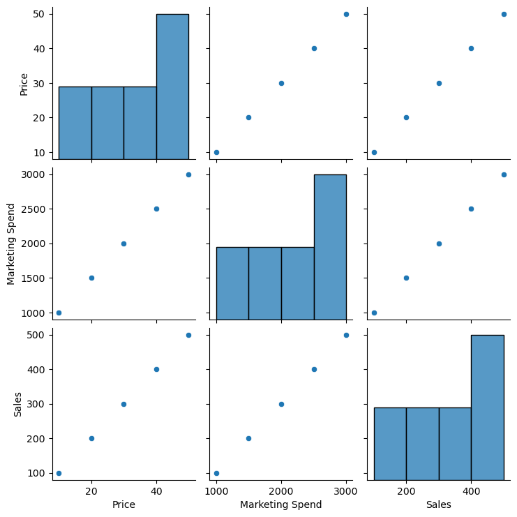
    


#### **Program 4: Real-World Scenario – Barplot for Sales by Region**


```python
import seaborn as sns  # Importing Seaborn for advanced plotting
import matplotlib.pyplot as plt  # Importing Matplotlib for displaying the plot

# Sales data by region
data = {
    'Region': ['North', 'South', 'East', 'West'],
    'Sales': [5000, 7000, 8000, 6000]
}

# Create a barplot for average sales by region
sns.barplot(x='Region', y='Sales', data=data)  # Barplot showing sales by region
plt.title('Average Sales by Region')  # Adds a title
plt.show()  # Displays the plot
```


    

    


---

### **Lecture 8: Advanced Regression and Distribution Plots**

#### **Program 1: Regression Plot with Seaborn**


```python
# import seaborn as sns  # Importing Seaborn for advanced plotting
import matplotlib.pyplot as plt  # Importing Matplotlib for displaying the plot
import pandas as pd  # Importing Pandas to handle tabular data

# Sample data for product price vs sales
data = pd.DataFrame({
    'Price': [10, 20, 30, 40, 50],
    'Sales': [100, 200, 300, 400, 500]
})

# Create a regression plot
sns.regplot(x='Price', y='Sales', data=data)  # Scatter plot with a regression line
plt.title('Price vs Sales Regression Plot')  # Adds a title
plt.show()  # Displays the plot

```


    

    


#### **Program 2: Distribution Plot for Sales**


```python
import seaborn as sns  # Importing Seaborn for advanced plotting
import matplotlib.pyplot as plt  # Importing Matplotlib for displaying the plot

# Sample data for monthly sales
sales = [100, 150, 200, 250, 300, 350, 400]  # Sales data

# Create a KDE plot to visualize the distribution of sales
sns.kdeplot(sales, fill=True)  # KDE plot with shaded area
plt.title('Sales Distribution')  # Adds a title
plt.show()  # Displays the plot

```


    
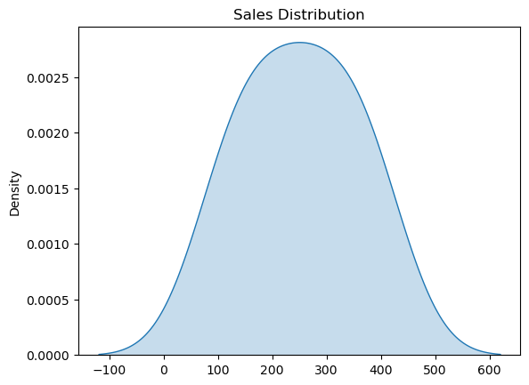
    


#### **Program 3: Boxplot for Sales across Multiple Regions**


```python
import seaborn as sns  # Importing Seaborn for advanced plotting
import matplotlib.pyplot as plt  # Importing Matplotlib for displaying the plot

# Sample data for product sales in different regions
sales_data = {
    'Region': ['North', 'South', 'East', 'West'],
    'Sales': [200, 250, 300, 350]
}

# Create a boxplot for sales by region
sns.boxplot(x='Region', y='Sales', data=sales_data)  # Boxplot comparing sales across different regions
plt.title('Sales Distribution by Region')  # Adds a title
plt.show()  # Displays the plot

```


    
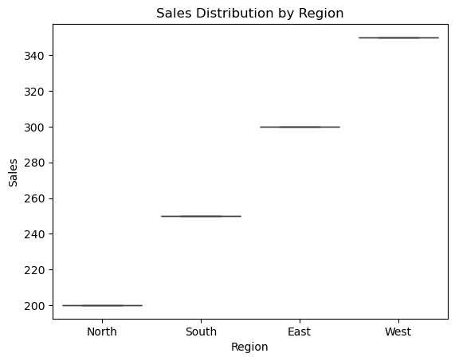
    


#### **Program 4: Real-World Scenario – Regression with Multiple Variables**


```python
import seaborn as sns  # Importing Seaborn for advanced plotting
import matplotlib.pyplot as plt  # Importing Matplotlib for displaying the plot
import pandas as pd

# Sample data for marketing spend, price, and sales
data = pd.DataFrame({
    'Price': [10, 20, 30, 40, 50],
    'Marketing Spend': [1000, 1500, 2000, 2500, 3000],
    'Sales': [100, 200, 300, 400, 500]
})

# Create a regression plot for multiple variables
sns.regplot(x='Price', y='Sales', data=data, scatter_kws={'color': 'blue'})  # Regression for price vs sales
sns.regplot(x='Marketing Spend', y='Sales', data=data, scatter_kws={'color': 'red'})  # Regression for marketing spend vs sales
plt.title('Sales vs Price and Marketing Spend')  # Adds a title
plt.show()  # Displays the plot

```


    
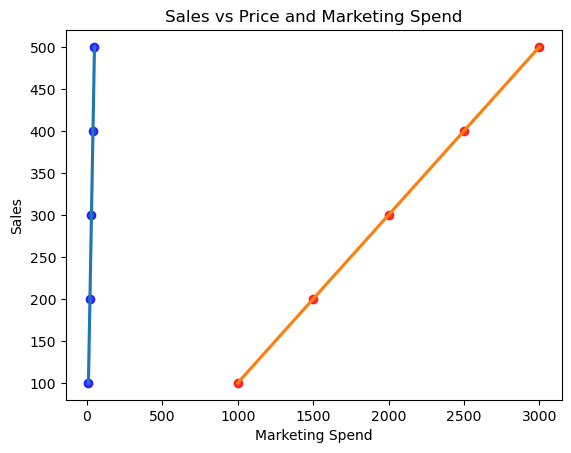
    


---

### **Lecture 9: Saving and Sharing Visualizations**

#### **Program 1: Saving a Plot as an Image**


```python
import matplotlib.pyplot as plt  # Importing the library for plotting

# Sales data
months = ['Jan', 'Feb', 'Mar', 'Apr', 'May', 'Jun']  # List of months
sales = [200, 220, 240, 260, 280, 300]  # Sales data for each month

# Create the plot
plt.plot(months, sales, marker='o')  # Line plot with circular markers

# Save the plot as a PNG file
plt.savefig('sales_growth.png')  # Saves the plot as an image file
plt.show()  # Displays the plot

```


    

    


#### **Program 2: Saving a Plot as a PDF**


```python
import matplotlib.pyplot as plt  # Importing the library for plotting

# Monthly sales data
months = ['Jan', 'Feb', 'Mar', 'Apr', 'May']  # List of months
sales = [500, 600, 700, 800, 900]  # Sales data for each month

# Create the plot
plt.plot(months, sales, marker='x')  # Line plot with x markers

# Save the plot as a PDF
plt.savefig('monthly_sales.pdf', format='pdf')  # Saves the plot as a PDF
plt.show()  # Displays the plot

```


    
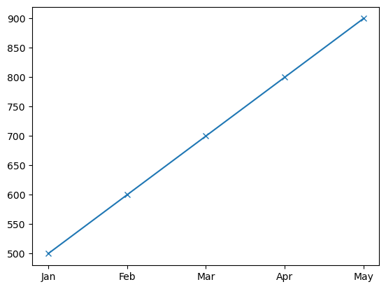
    


#### **Program 3: Real-World Scenario – Creating a Presentation**


```python
import matplotlib.pyplot as plt  # Importing the library for plotting

# Sales and profit data
sales = [200, 250, 300, 350]  # Sales data for each month
profits = [100, 150, 200, 250]  # Profit data for each month

# Create the plot for sales
plt.plot(sales, label='Sales')  # Line plot for sales
plt.title('Sales Growth')  # Adds a title
plt.xlabel('Months')  # Labels the x-axis
plt.ylabel('Sales ($)')  # Labels the y-axis
plt.savefig('sales_growth.png')  # Save the plot as an image

# Create another plot for profits
plt.figure()  # Creates a new figure
plt.plot(profits, label='Profits', color='green')  # Line plot for profits
plt.title('Profit Growth')  # Adds a title
plt.xlabel('Months')  # Labels the x-axis
plt.ylabel('Profits ($)')  # Labels the y-axis
plt.savefig('profit_growth.png')  # Save the plot as an image
plt.show()  # Displays the plots

```


    
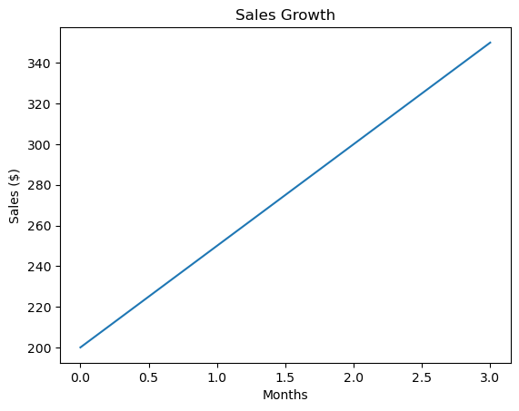
    


    
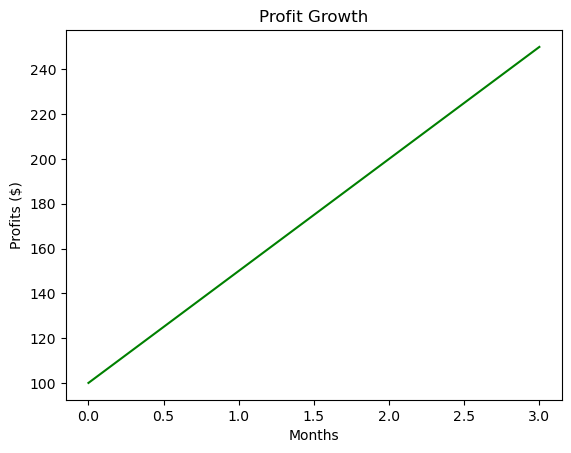
    


#### **Program 4: Exporting Plot to SVG**


```python
import matplotlib.pyplot as plt  # Importing the library for plotting

# Data for visualization
months = ['Jan', 'Feb', 'Mar', 'Apr']  # List of months
sales = [500, 600, 700, 800]  # Sales data for each month

# Create the plot
plt.plot(months, sales, marker='o')  # Line plot with circular markers

# Save the plot as an SVG file
plt.savefig('sales_growth.svg', format='svg')  # Saves the plot as an SVG file
plt.show()  # Displays the plot

```


    
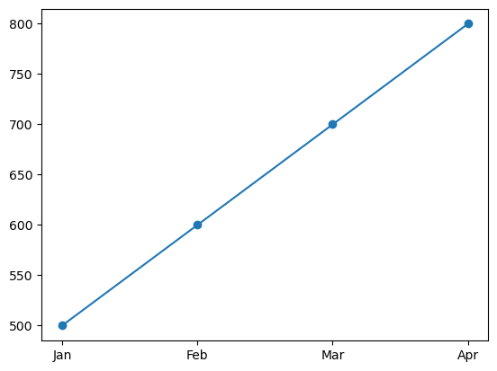
    


#### **Program 5: Sharing Plots**


```python
import matplotlib.pyplot as plt  # Importing the library for plotting

# Sales data
months = ['Jan', 'Feb', 'Mar', 'Apr', 'May']  # List of months
sales = [100, 150, 200, 250, 300]  # Sales data for each month

# Create the plot
plt.plot(months, sales, marker='o')  # Line plot with circular markers

# Save and share the plot
plt.savefig('sales_trend.png')  # Saves the plot as an image
plt.show()  # Displays the plot

```


    
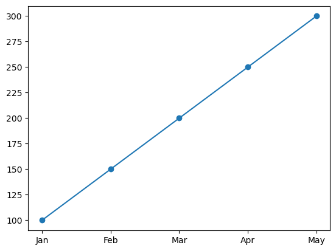
    

