# `Matplotlib`

# `What is Matplotlib?`
Matplotlib is a low level graph plotting library in python that serves as a visualization utility.

Matplotlib was created by John D. Hunter.

Matplotlib is open source and we can use it freely.

Matplotlib is mostly written in python, a few segments are written in C, Objective-C and Javascript for Platform compatibility.
# `Installation of Matplotlib`
If you have Python and PIP already installed on a system, then installation of Matplotlib is very easy.

Install it using this command:
### `pip install matplotlib` or `py -m pip install matplotlib`

# `Now import library`


```python
import matplotlib
```


```python
import matplotlib

print(matplotlib.__version__)
```

    3.3.4
    

# `Matplotlib.pyplot`
# `Pyplot`
Most of the Matplotlib utilities lies under the pyplot submodule, and are usually imported under the plt alias:


```python
from matplotlib import pyplot as plt  

#ploting our canvas

x=[1,2,3,4,5]
y=[10,9,8,7,6]

plt.plot(x,y)

#display the graph  
plt.show()  
```


    

    


```python
import matplotlib.pyplot as plt
import numpy as np

xpoints = np.array([0, 6])
ypoints = np.array([0, 250])

plt.plot(xpoints, ypoints)
plt.show()
```


    

    


```python
import matplotlib.pyplot as plt

# initializing the data
x = [10, 20, 30, 40]
y = [20, 30, 40, 50]

# plotting the data
plt.plot(x, y)

# Adding the title

plt.title("Simple Plot")
# Adding the labels

plt.ylabel("y-axis")
plt.xlabel("x-axis")

plt.show()
```


    
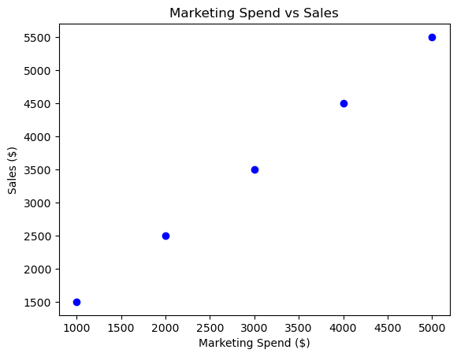
    


```python
# Python program to show pyplot module
import matplotlib.pyplot as plt
plt.plot([1, 2, 3, 4], [1, 4, 9, 16])
plt.axis([0, 6, 0, 20]) # ([xmin, xmax, ymin, ymax])
plt.show()

```


    

    


```python
import matplotlib.pyplot as plt
import numpy as np

xpoints = np.array([1, 8])
ypoints = np.array([3, 10])

plt.plot(xpoints, ypoints)
plt.show()
```


    
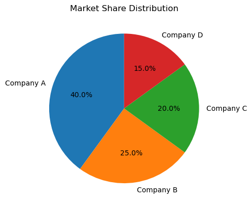
    


<pre>
Signature: plt.plot(*args, scalex=True, scaley=True, data=None, **kwargs)
Docstring:
Plot y versus x as lines and/or markers.

Call signatures::

    plot([x], y, [fmt], *, data=None, **kwargs)
    plot([x], y, [fmt], [x2], y2, [fmt2], ..., **kwargs)

The coordinates of the points or line nodes are given by *x*, *y*.

The optional parameter *fmt* is a convenient way for defining basic
formatting like color, marker and linestyle. It's a shortcut string
notation described in the *Notes* section below.

>>> plot(x, y)        # plot x and y using default line style and color
>>> plot(x, y, 'bo')  # plot x and y using blue circle markers
>>> plot(y)           # plot y using x as index array 0..N-1
>>> plot(y, 'r+')     # ditto, but with red plusses

You can use `.Line2D` properties as keyword arguments for more
control on the appearance. Line properties and *fmt* can be mixed.
The following two calls yield identical results:

>>> plot(x, y, 'go--', linewidth=2, markersize=12)
>>> plot(x, y, color='green', marker='o', linestyle='dashed',
...      linewidth=2, markersize=12)

When conflicting with *fmt*, keyword arguments take precedence.


**Plotting labelled data**

There's a convenient way for plotting objects with labelled data (i.e.
data that can be accessed by index ``obj['y']``). Instead of giving
the data in *x* and *y*, you can provide the object in the *data*
parameter and just give the labels for *x* and *y*::

>>> plot('xlabel', 'ylabel', data=obj)

All indexable objects are supported. This could e.g. be a `dict`, a
`pandas.DataFrame` or a structured numpy array.


**Plotting multiple sets of data**

There are various ways to plot multiple sets of data.

- The most straight forward way is just to call `plot` multiple times.
  Example:

  >>> plot(x1, y1, 'bo')
  >>> plot(x2, y2, 'go')

- If *x* and/or *y* are 2D arrays a separate data set will be drawn
  for every column. If both *x* and *y* are 2D, they must have the
  same shape. If only one of them is 2D with shape (N, m) the other
  must have length N and will be used for every data set m.

  Example:

  >>> x = [1, 2, 3]
  >>> y = np.array([[1, 2], [3, 4], [5, 6]])
  >>> plot(x, y)

  is equivalent to:

  >>> for col in range(y.shape[1]):
  ...     plot(x, y[:, col])

- The third way is to specify multiple sets of *[x]*, *y*, *[fmt]*
  groups::

  >>> plot(x1, y1, 'g^', x2, y2, 'g-')

  In this case, any additional keyword argument applies to all
  datasets. Also this syntax cannot be combined with the *data*
  parameter.

By default, each line is assigned a different style specified by a
'style cycle'. The *fmt* and line property parameters are only
necessary if you want explicit deviations from these defaults.
Alternatively, you can also change the style cycle using
:rc:`axes.prop_cycle`.


Parameters
----------
x, y : array-like or scalar
    The horizontal / vertical coordinates of the data points.
    *x* values are optional and default to ``range(len(y))``.

    Commonly, these parameters are 1D arrays.

    They can also be scalars, or two-dimensional (in that case, the
    columns represent separate data sets).

    These arguments cannot be passed as keywords.

fmt : str, optional
    A format string, e.g. 'ro' for red circles. See the *Notes*
    section for a full description of the format strings.

    Format strings are just an abbreviation for quickly setting
    basic line properties. All of these and more can also be
    controlled by keyword arguments.

    This argument cannot be passed as keyword.

data : indexable object, optional
    An object with labelled data. If given, provide the label names to
    plot in *x* and *y*.

    .. note::
        Technically there's a slight ambiguity in calls where the
        second label is a valid *fmt*. ``plot('n', 'o', data=obj)``
        could be ``plt(x, y)`` or ``plt(y, fmt)``. In such cases,
        the former interpretation is chosen, but a warning is issued.
        You may suppress the warning by adding an empty format string
        ``plot('n', 'o', '', data=obj)``.

Returns
-------
list of `.Line2D`
    A list of lines representing the plotted data.

Other Parameters
----------------
scalex, scaley : bool, default: True
    These parameters determine if the view limits are adapted to the
    data limits. The values are passed on to `autoscale_view`.

**kwargs : `.Line2D` properties, optional
    *kwargs* are used to specify properties like a line label (for
    auto legends), linewidth, antialiasing, marker face color.
    Example::

    >>> plot([1, 2, 3], [1, 2, 3], 'go-', label='line 1', linewidth=2)
    >>> plot([1, 2, 3], [1, 4, 9], 'rs', label='line 2')

    If you specify multiple lines with one plot call, the kwargs apply
    to all those lines. In case the label object is iterable, each
    element is used as labels for each set of data.

    Here is a list of available `.Line2D` properties:

    Properties:
    agg_filter: a filter function, which takes a (m, n, 3) float array and a dpi value, and returns a (m, n, 3) array
    alpha: scalar or None
    animated: bool
    antialiased or aa: bool
    clip_box: `.Bbox`
    clip_on: bool
    clip_path: Patch or (Path, Transform) or None
    color or c: color
    dash_capstyle: `.CapStyle` or {'butt', 'projecting', 'round'}
    dash_joinstyle: `.JoinStyle` or {'miter', 'round', 'bevel'}
    dashes: sequence of floats (on/off ink in points) or (None, None)
    data: (2, N) array or two 1D arrays
    drawstyle or ds: {'default', 'steps', 'steps-pre', 'steps-mid', 'steps-post'}, default: 'default'
    figure: `.Figure`
    fillstyle: {'full', 'left', 'right', 'bottom', 'top', 'none'}
    gid: str
    in_layout: bool
    label: object
    linestyle or ls: {'-', '--', '-.', ':', '', (offset, on-off-seq), ...}
    linewidth or lw: float
    marker: marker style string, `~.path.Path` or `~.markers.MarkerStyle`
    markeredgecolor or mec: color
    markeredgewidth or mew: float
    markerfacecolor or mfc: color
    markerfacecoloralt or mfcalt: color
    markersize or ms: float
    markevery: None or int or (int, int) or slice or list[int] or float or (float, float) or list[bool]
    path_effects: `.AbstractPathEffect`
    picker: float or callable[[Artist, Event], tuple[bool, dict]]
    pickradius: float
    rasterized: bool
    sketch_params: (scale: float, length: float, randomness: float)
    snap: bool or None
    solid_capstyle: `.CapStyle` or {'butt', 'projecting', 'round'}
    solid_joinstyle: `.JoinStyle` or {'miter', 'round', 'bevel'}
    transform: unknown
    url: str
    visible: bool
    xdata: 1D array
    ydata: 1D array
    zorder: float

See Also
--------
scatter : XY scatter plot with markers of varying size and/or color (
    sometimes also called bubble chart).

Notes
-----
**Format Strings**

A format string consists of a part for color, marker and line::

    fmt = '[marker][line][color]'

Each of them is optional. If not provided, the value from the style
cycle is used. Exception: If ``line`` is given, but no ``marker``,
the data will be a line without markers.

Other combinations such as ``[color][marker][line]`` are also
supported, but note that their parsing may be ambiguous.

**Markers**

=============   ===============================
character       description
=============   ===============================
``'.'``         point marker
``','``         pixel marker
``'o'``         circle marker
``'v'``         triangle_down marker
``'^'``         triangle_up marker
``'<'``         triangle_left marker
``'>'``         triangle_right marker
``'1'``         tri_down marker
``'2'``         tri_up marker
``'3'``         tri_left marker
``'4'``         tri_right marker
``'8'``         octagon marker
``'s'``         square marker
``'p'``         pentagon marker
``'P'``         plus (filled) marker
``'*'``         star marker
``'h'``         hexagon1 marker
``'H'``         hexagon2 marker
``'+'``         plus marker
``'x'``         x marker
``'X'``         x (filled) marker
``'D'``         diamond marker
``'d'``         thin_diamond marker
``'|'``         vline marker
``'_'``         hline marker
=============   ===============================

**Line Styles**

=============    ===============================
character        description
=============    ===============================
``'-'``          solid line style
``'--'``         dashed line style
``'-.'``         dash-dot line style
``':'``          dotted line style
=============    ===============================

Example format strings::

    'b'    # blue markers with default shape
    'or'   # red circles
    '-g'   # green solid line
    '--'   # dashed line with default color
    '^k:'  # black triangle_up markers connected by a dotted line

**Colors**

The supported color abbreviations are the single letter codes

=============    ===============================
character        color
=============    ===============================
``'b'``          blue
``'g'``          green
``'r'``          red
``'c'``          cyan
``'m'``          magenta
``'y'``          yellow
``'k'``          black
``'w'``          white
=============    ===============================

and the ``'CN'`` colors that index into the default property cycle.

If the color is the only part of the format string, you can
additionally use any  `matplotlib.colors` spec, e.g. full names
(``'green'``) or hex strings (``'#008000'``).
File:      c:\users\mrahe\anaconda3\lib\site-packages\matplotlib\pyplot.py
Type:      function
</per>


```python
# Plotting Without Line
# To plot only the markers, you can use shortcut string notation parameter 'o', which means 'rings'.

import matplotlib.pyplot as plt
import numpy as np

xpoints = np.array([1, 8])
ypoints = np.array([3, 10])

plt.plot(xpoints, ypoints, 'p')
plt.show()
```


    

    


```python
from matplotlib import pyplot as plt

days = [1,2,3,4,5,6,7,8,9,10,11,12,13,14,15]
karachi_temp = [36.6, 37, 37.7,39,40.1,43,43.4,45,45.6,40.1,44,45,46.8,47,47.8]
lahore_temp = [39,39.4,40,40.7,41,42.5,43.5,44,44.9,44,45,45.1,46,47,46]

plt.plot(days,karachi_temp, "o")
plt.plot(days, lahore_temp, 'p')
plt.show()
```


    

    


```python
import matplotlib.pyplot as plt
import numpy as np

xpoints = np.array([1, 2, 6, 8])
ypoints = np.array([3, 8, 1, 10])

plt.plot(xpoints, ypoints)
plt.show()
```


    
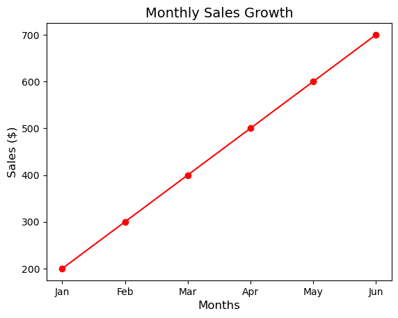
    


```python
import matplotlib.pyplot as plt 

days = [1,2,3,4,5,6,7,8,9,10,11,12,13,14,15]
temperature = [36.6, 37, 37.7,39,40.1,43,43.4,45,45.6,40.1,44,45,46.8,47,47.8]

plt.plot(days, temperature)
plt.title("Karachi")
plt.xlabel("Temperature")
plt.ylabel("Days")
plt.show()
```


    

    


```python
import matplotlib.pyplot as plt 

days = [1,2,3,4,5,6,7,8,9,10,11,12,13,14,15]
temperature = [36.6, 37, 37.7,39,40.1,43,43.4,45,45.6,40.1,44,45,46.8,47,47.8]

plt.plot(days, temperature,  color = "g", marker = "o",
         linestyle= "--", linewidth = 3,  markersize = 8)
plt.title("Karachi")
plt.ylabel("Temperature")
plt.xlabel("Days")
plt.show()
```


    

    


```python
from matplotlib import style # import style module

days = [1,2,3,4,5,6,7,8,9,10,11,12,13,14,15]
temperature = [36.6, 37, 37.7,39,40.1,43,43.4,45,45.6,40.1,44,45,46.8,47,47.8]


# Syntax: style.use(style)
# To add a legend in the graph to describe more information about it, use plt.legend().
style.use("ggplot") # give ggplot parameter value to use() method

plt.plot(days, temperature, "mo--", linewidth = 3,
        markersize = 12, label = "Temp line")

plt.title("Karachi Temperature", fontsize=15)
plt.xlabel("days",fontsize=13)
plt.ylabel("temperature",fontsize=13)
plt.legend(loc = 4) 
plt.show()
```


    

    


```python
days = [1,2,3,4,5,6,7,8,9,10,11,12,13,14,15]
karachi_temp = [36.6, 37, 37.7,39,40.1,43,43.4,45,45.6,40.1,44,45,46.8,47,47.8]
lahore_temp = [39,39.4,40,40.7,41,42.5,43.5,44,44.9,44,45,45.1,46,47,46]
 
plt.plot(days, karachi_temp, "mo--", linewidth = 3,
        markersize = 10, label = "Karachi Temperature")
 
plt.plot(days, lahore_temp, "yo:", linewidth = 3,
        markersize = 10, label = "Lahore Temperature}")
 
plt.title("Karachi  & Lahore Temperature", fontsize=15)
plt.xlabel("Days",fontsize=13)
plt.ylabel("Temperature",fontsize=13)
plt.legend(loc = 4) # use fir 4 axis
plt.show()
```


    
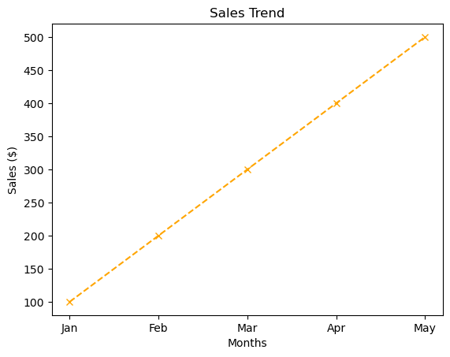
    


```python
days = [1,2,3,4,5,6,7,8,9,10,11,12,13,14,15]
karachi_temp = [36.6, 37, 37.7,39,40.1,43,43.4,45,45.6,40.1,44,45,46.8,47,47.8]
lahore_temp = [39,39.4,40,40.7,41,42.5,43.5,44,44.9,44,45,45.1,46,47,46]
 
plt.plot(days, karachi_temp, "mo--", linewidth = 3,
        markersize = 10, label = "Karachi Temperature")
 
plt.plot(days, lahore_temp, "yo:", linewidth = 3,
        markersize = 10, label = "Lahore Temperature}")
 
plt.title("Karachi  & Lahore Temperature", fontsize=15)
plt.xlabel("Days",fontsize=13)
plt.ylabel("Temperature",fontsize=13)
plt.legend(loc = 4)
plt.grid(color='#C1C1C1', linestyle='-', linewidth=2) # grid with parameter
plt.show()

```


    

    


# Ploting Histograms
Histogram
A histogram is a graph showing frequency distributions.

It is a graph showing the number of observations within each given interval.

Example: Say you ask for the height of 250 people, you might end up with a histogram like this:


```python
import matplotlib.pyplot as plt
import numpy as np
import random
```


```python
ml_students_age = np.random.randint(18,45, (100))
py_students_age = np.random.randint(15,40, (100))
```


```python
print(ml_students_age)
print(py_students_age)
```

    [40 21 24 35 22 18 42 41 35 28 27 37 22 35 22 26 31 18 19 27 25 28 29 25
     36 36 26 21 30 38 19 32 36 32 41 24 38 44 18 43 24 35 31 39 37 37 34 35
     29 44 28 23 18 39 31 43 35 34 36 31 38 19 39 38 32 23 21 22 30 19 39 32
     31 25 38 27 19 44 20 18 44 18 30 28 42 24 42 24 31 43 21 24 38 30 36 24
     37 40 43 33]
    [27 16 39 17 39 37 21 28 18 19 15 21 15 34 37 38 16 28 22 33 23 34 25 39
     31 36 21 33 15 22 23 15 17 31 38 39 31 25 19 37 26 19 24 35 28 27 35 29
     29 25 23 15 33 29 34 37 31 17 15 32 35 33 34 35 19 23 20 35 20 24 20 39
     37 32 35 35 17 22 36 32 35 17 16 30 37 30 18 32 37 34 38 25 33 31 33 36
     34 30 22 28]
    


```python
plt.hist(ml_students_age)

plt.title("ML Students age histograms")
plt.xlabel("Students age cotegory")
plt.ylabel("No. Students age")
plt.show()
```


    

    


<pre>
"""
plt.hist(
    x,
    bins=None,
    range=None,
    density=None,
    weights=None,
    cumulative=False,
    bottom=None,
    histtype='bar',
    align='mid',
    orientation='vertical',
    rwidth=None,
    log=False,
    color=None,
    label=None,
    stacked=False,
    normed=None,
    *,
    data=None,
    **kwargs,
)

x, or format []
bins=None or sequence
histtype : {'bar', 'barstacked', 'step',  'stepfilled'}
align : {'left', 'mid', 'right'}
orientation : {'horizontal', 'vertical'}
rwidth : scalar or None
color : color or format []
label : str or format []
"""
</pre>


```python
bins = [15,20,25,30,35,40,45]
plt.figure(figsize = (15,5)) # hight & width


plt.hist(ml_students_age, bins, rwidth=0.8,
         orientation='vertical', color = "m", label = "ML Student")

plt.title("ML Students age histograms")
plt.xlabel("Students age cotegory")
plt.ylabel("No. Students age")
plt.legend()
plt.show()
```


    
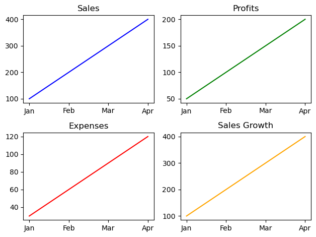
    


```python
from matplotlib import style
style.use("ggplot")
plt.figure(figsize = (16,9))

plt.hist([ml_students_age, py_students_age], bins, rwidth=0.8, histtype = "bar",
         orientation='vertical', color = ["m", "y"], label = ["ML Student", "Py Student"])

#plt.hist(py_students_age, bins, rwidth=0.8, histtype = "bar",
#         orientation='vertical', color = "y", label = "Py Student")

plt.title("ML & Py Students age histograms")
plt.xlabel("Students age cotegory")
plt.ylabel("No. Students age")
plt.legend()
plt.show()
```


    

    


# `Ploting Bar Chart`


```python
import matplotlib.pyplot as plt
import numpy as np

x = np.array(["A", "B", "C", "D"])
y = np.array([3, 8, 1, 10])

plt.bar(x,y)
plt.show()

```


    

    


```python
import matplotlib.pyplot as plt
import numpy as np
# from matplotlib import style

classes = ["Python", "R", "AI", "ML", "DS"]
class1_students = [30, 10, 20, 25, 10] # out of 100 student in each class
class2_students = [40, 5, 20, 20, 10]
class3_students = [35, 5, 30, 15, 15]

plt.bar(classes, class1_students)
plt.show()
```


    
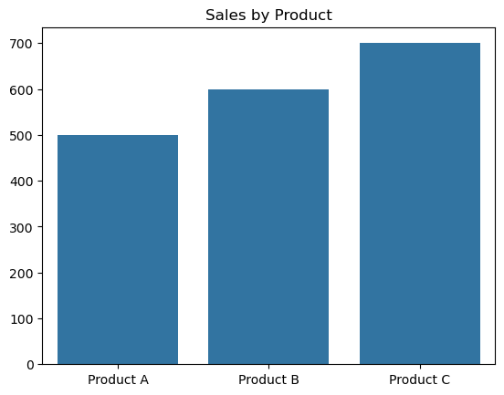
    


```python
plt.bar(classes, class2_students)
plt.show()
```


    

    


```python
plt.bar(classes, class3_students)
plt.show()
```


    

    


```python
import matplotlib.pyplot as plt
import numpy as np
# from matplotlib import style

classes = ["Python", "R", "AI", "ML", "DS"]
class1_students = [30, 10, 20, 25, 10] # out of 100 student in each class
class2_students = [40, 5, 20, 20, 10]
class3_students = [35, 5, 30, 15, 15]

plt.bar(classes, class1_students,label="Class 1")
plt.bar(classes, class2_students,label="Class 2")
plt.bar(classes, class3_students,label="Class 3")
plt.legend()
plt.show()
```


    

    


```python
import matplotlib.pyplot as plt
import numpy as np

x = np.array(["A", "B", "C", "D"])
y = np.array([3, 8, 1, 10])

plt.bar(x, y, color = "red")
plt.show()
```


    
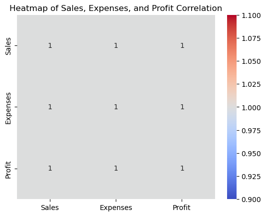
    


```python
import matplotlib.pyplot as plt
import numpy as np

x = np.array(["A", "B", "C", "D"])
y = np.array([3, 8, 1, 10])

plt.bar(x, y, color = "hotpink")
plt.show()
```


    

    


```python
import matplotlib.pyplot as plt
import numpy as np

x = np.array(["A", "B", "C", "D"])
y = np.array([3, 8, 1, 10])

plt.bar(x, y, color = "#4CAF50")
plt.show()
```


    

    


```python
import matplotlib.pyplot as plt
import numpy as np

x = np.array(["A", "B", "C", "D"])
y = np.array([3, 8, 1, 10])

plt.bar(x, y, width = 0.1)
plt.show()
```


    

    


# `Horizontal Bars`


```python
import matplotlib.pyplot as plt
import numpy as np

x = np.array(["A", "B", "C", "D"])
y = np.array([3, 8, 1, 10])

plt.barh(x, y)
plt.show()
```


    

    


```python
import matplotlib.pyplot as plt
import numpy as np

x = np.array(["A", "B", "C", "D"])
y = np.array([3, 8, 1, 10])

plt.barh(x, y, height = 0.1)
plt.show()
```


    

    


```python
import matplotlib.pyplot as plt
import numpy as np

x = np.array(["A", "B", "C", "D"])
y = np.array([3, 8, 1, 10])

plt.barh(x, y, color = "#4CAF50")
plt.show()
```


    

    


# `Scatter Plots`


```python
import matplotlib.pyplot as plt
import numpy as np

x = np.array([5,7,8,7,2,17,2,9,4,11,12,9,6])
y = np.array([99,86,87,88,111,86,103,87,94,78,77,85,86])

plt.scatter(x, y)
plt.show()
```


    

    


```python
import matplotlib.pyplot as plt
import numpy as np

#day one, the age and speed of 13 cars:
x = np.array([5,7,8,7,2,17,2,9,4,11,12,9,6])
y = np.array([99,86,87,88,111,86,103,87,94,78,77,85,86])
plt.scatter(x, y)

#day two, the age and speed of 15 cars:
x = np.array([2,2,8,1,15,8,12,9,7,3,11,4,7,14,12])
y = np.array([100,105,84,105,90,99,90,95,94,100,79,112,91,80,85])
plt.scatter(x, y)

plt.show()
```


    

    


```python
import matplotlib.pyplot as plt
import numpy as np

x = np.array([5,7,8,7,2,17,2,9,4,11,12,9,6])
y = np.array([99,86,87,88,111,86,103,87,94,78,77,85,86])
plt.scatter(x, y, color = 'hotpink')

x = np.array([2,2,8,1,15,8,12,9,7,3,11,4,7,14,12])
y = np.array([100,105,84,105,90,99,90,95,94,100,79,112,91,80,85])
plt.scatter(x, y, color = '#88c999')

plt.show()
```


    

    


```python
import matplotlib.pyplot as plt
import numpy as np

x = np.array([5,7,8,7,2,17,2,9,4,11,12,9,6])
y = np.array([99,86,87,88,111,86,103,87,94,78,77,85,86])
colors = np.array(["red","green","blue","yellow","pink",
                   "black","orange","purple","beige","brown","gray","cyan","magenta"])

plt.scatter(x, y, c=colors)

plt.show()
```


    

    


```python
import matplotlib.pyplot as plt
import numpy as np

x = np.array([5,7,8,7,2,17,2,9,4,11,12,9,6])
y = np.array([99,86,87,88,111,86,103,87,94,78,77,85,86])
sizes = np.array([20,50,100,200,500,10000,60,90,10,300,600,800,75])

plt.scatter(x, y, s=sizes)

plt.show()
```


    

    


# `Pie Charts`


```python
from matplotlib import pyplot as plt
import numpy as np

cars = ['AUDI', 'BMW', 'FORD','TESLA', 'JAGUAR', 'MERCEDES']
data = [23, 17, 35, 29, 12, 41]

plt.pie(data)

plt.show()

```


    

    


```python
from matplotlib import pyplot as plt
import numpy as np

cars = ['AUDI', 'BMW', 'FORD','TESLA', 'JAGUAR', 'MERCEDES']
data = [23, 17, 35, 29, 12, 41]

plt.pie(data, labels = cars)

# show plot
plt.show()

```


    
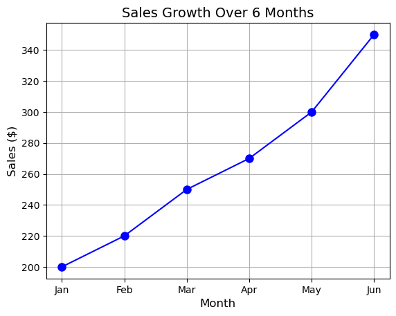
    


```python
import matplotlib.pyplot as plt
import numpy as np

y = np.array([35, 25, 25, 15])
mylabels = ["Apples", "Bananas", "Cherries", "Dates"]

plt.pie(y, labels = mylabels)
plt.show() 
```


    

    


```python
import matplotlib.pyplot as plt
import numpy as np

y = np.array([35, 25, 25, 15])
mylabels = ["Apples", "Bananas", "Cherries", "Dates"]

plt.pie(y, labels = mylabels, startangle = 90)
plt.show() 
```


    

    


```python
import matplotlib.pyplot as plt
import numpy as np

y = np.array([35, 25, 25, 15])
mylabels = ["Apples", "Bananas", "Cherries", "Dates"]
myexplode = [0.6, 0, 0, 0]

plt.pie(y, labels = mylabels, explode = myexplode)
plt.show() 
```


    

    


```python
import matplotlib.pyplot as plt
import numpy as np

y = np.array([35, 25, 25, 15])
mylabels = ["Apples", "Bananas", "Cherries", "Dates"]
myexplode = [0.2, 0.2, 0.2, 0.2]

plt.pie(y, labels = mylabels, explode = myexplode)
plt.show() 
```


    
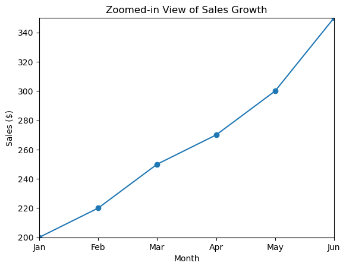
    


```python
import matplotlib.pyplot as plt
import numpy as np

y = np.array([35, 25, 25, 15])
mylabels = ["Apples", "Bananas", "Cherries", "Dates"]
myexplode = [0.2, 0, 0, 0]

plt.pie(y, labels = mylabels, explode = myexplode, shadow = True)
plt.show()
```


    

    


```python
import matplotlib.pyplot as plt
import numpy as np

y = np.array([35, 25, 25, 15])
mylabels = ["Apples", "Bananas", "Cherries", "Dates"]
mycolors = ["black", "hotpink", "b", "#4CAF50"]

plt.pie(y, labels = mylabels, colors = mycolors)
plt.show() 
```


    
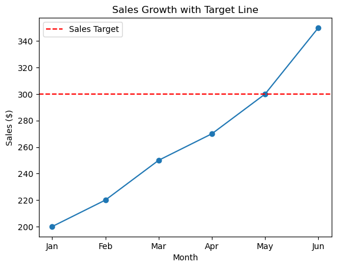
    


```python
import matplotlib.pyplot as plt
import numpy as np

y = np.array([35, 25, 25, 15])
mylabels = ["Apples", "Bananas", "Cherries", "Dates"]

plt.pie(y, labels = mylabels)
plt.legend()
plt.show()
```


    
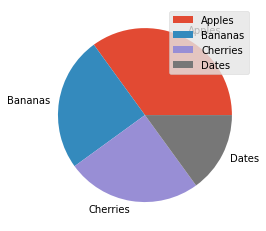
    


```python
import matplotlib.pyplot as plt
import numpy as np

y = np.array([35, 25, 25, 15])
mylabels = ["Apples", "Bananas", "Cherries", "Dates"]

plt.pie(y, labels = mylabels)
plt.legend(title = "Four Fruits:")
plt.show() 
```


    
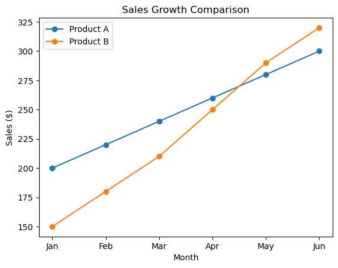
    

