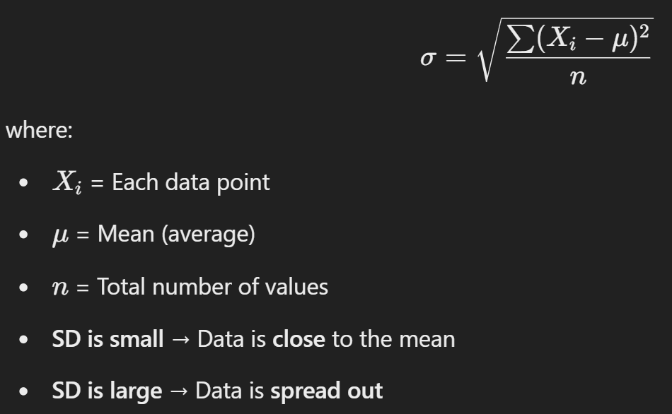
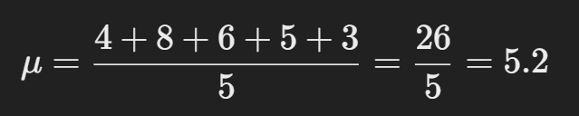
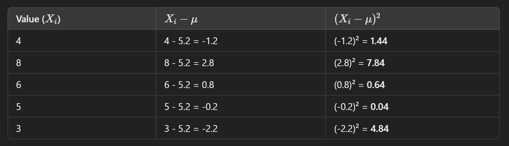
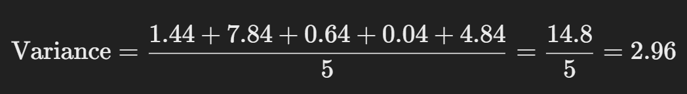
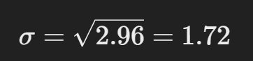

### **Lecture 1: Introduction to NumPy**

#### **What is NumPy and Why is it Important?**

NumPy (Numerical Python) is a library in Python used for numerical and matrix operations. It's extremely useful for scientific computing, data analysis, and machine learning tasks. You can perform fast array operations and complex mathematical functions with it.

**Why is it important?**
- It allows efficient handling of large datasets.
- NumPy arrays are faster than Python lists for mathematical operations.
- Provides support for multidimensional arrays.
- Forms the backbone for other Python libraries like Pandas, SciPy, etc.

---

#### **Installing and Importing NumPy:**
Before you can use NumPy, you'll need to install it via the following:
```bash
pip install numpy
```
To use NumPy in your code:
```python
import numpy as np
```

#### **Program 1: Creating a Simple 1D Array**


```python
import numpy as np

# Creating a 1D array to represent temperatures of 7 days
temperature = np.array([22, 24, 20, 23, 25, 21, 22])
print("Weekly Temperatures:", temperature)
```

    Weekly Temperatures: [22 24 20 23 25 21 22]
    


```python
import numpy as np

# Creating a 1D array to represent temperatures of 7 days
temperature = np.array([22, 24, 20, 23, 25, 21, 22])

print("Shape of array:", temperature.shape)
print("Size of array:", temperature.size)
```

    Shape of array: (7,)
    Size of array: 7
    

#### **Program 2: Array Shape and Size**


```python
import numpy as np

# Create a 1D array and check its shape and size
arr = np.array([10, 20, 30, 40, 50])
print("Shape of array:", arr.shape)
print("Size of array:", arr.size)

```

    Shape of array: (5,)
    Size of array: 5
    

#### **Program 3: Creating 1D-3D Arrays (Matrix)**

**matrix**, a set of numbers arranged in rows and columns so as to form a rectangular array. 

<!--  -->

<!--  -->


```python
import numpy as np

arr = np.array([1, 2, 3, 4, 5])
print("1D Array (Matrix):")
print(arr)
print(arr.ndim) # for finding dimensions
# arr.ndim #for dimension
```

    1D Array (Matrix):
    [1 2 3 4 5]
    1
    


```python
import numpy as np

# Creating a 2D array (Matrix)
arr = np.array([[1, 2, 3], [4, 5, 6]])
print("2D Array (Matrix):")
print(arr)
print(arr.ndim)
```

    2D Array (Matrix):
    [[1 2 3]
     [4 5 6]]
    2
    


```python
import numpy as np

# Creating a 2D array (Matrix)
arr = np.array([[[1, 2, 3], [4, 5, 6]]])
print("3D Array (Matrix):")
print(arr)
print(arr.ndim)
```

    3D Array (Matrix):
    [[[1 2 3]
      [4 5 6]]]
    3
    

#### **Program 4: Element-wise Operations on Arrays**


```python
import numpy as np

# Adding 5 to each element of the array
arr = np.array([10, 20, 30, 40])
arr_plus_5 = arr + 5
print("Array after adding 5:", arr_plus_5)
```

    Array after adding 5: [15 25 35 45]
    

#### **Program 5: Real-World Scenario – Weekly Sales Increase**


```python
import numpy as np

# Sales data for 5 weeks
sales = np.array([200, 220, 250, 230, 280])
# actual sale
print("The current sale is: ",sales)
# Calculate sales after a 10% increase for next week
new_sales = sales * 1.10
print("Sales after 10% increase:", new_sales)

```

    The current sale is:  [200 220 250 230 280]
    Sales after 10% increase: [220. 242. 275. 253. 308.]
    

---
### **Lecture 2: NumPy Array Operations**

#### **Program 1: Element-wise Addition**


```python
import numpy as np

# Adding two arrays element-wise
arr1 = np.array([1, 2, 3])
arr2 = np.array([4, 5, 6])

result = arr1 + arr2
print("Element-wise addition:", result)

```

    Element-wise addition: [5 7 9]
    

#### **Program 2: Scalar Multiplication**


```python
import numpy as np

# Multiplying each element of the array by a scalar value
arr = np.array([10, 20, 30])
scalar = 2
result = arr * scalar
print("Result after multiplying by scalar:", result)

```

    Result after multiplying by scalar: [20 40 60]
    


#### **Program 3: Real-World Scenario – Product Price Adjustment**


```python
import numpy as np

# Array of product prices
prices = np.array([100, 200, 300, 400, 500])

# Apply a 15% discount to each price
discounted_prices = prices * 0.85
print("Discounted Prices:", discounted_prices)

```

    Discounted Prices: [ 85. 170. 255. 340. 425.]
    

#### **Program 4: Trigonometric Operations**

##### **Radian formula: `Radians = Degrees × π/180°`**
##### **Degree formula: `Degrees = Radians × 180°/π`**


```python
import numpy as np

# Angles in degrees
angles = np.array([0, 30, 45, 60, 90])

# Convert angles to radians and calculate sine values
sine_values = np.sin(np.radians(angles))
print("Sine of angles:", sine_values)

```

    Sine of angles: [0.         0.5        0.70710678 0.8660254  1.        ]
    


```python
np.radians(45)
```


    0.7853981633974483


```python
np.sin(0.79)
```


    0.7103532724176078


#### **Program 5: Real-World Scenario – Temperature Conversion**

##### **Fahrenheit Formula: `°F = °C × (9/5) + 32`**
##### **Celsius Formula: `°C = (°F - 32) * 5/9`**


```python
import numpy as np

# Celsius temperatures for 5 days
celsius = np.array([0, 10, 20, 30, 40])

# Convert Celsius to Fahrenheit
fahrenheit = (celsius * 9/5) + 32
print("Fahrenheit Temperatures:", fahrenheit)
```

    Fahrenheit Temperatures: [ 32.  50.  68.  86. 104.]
    


```python
import numpy as np

# Fahrenheit temperatures for 5 days
fahrenheit = np.array([32, 50, 68, 86, 104])

# Convert Fahrenheit to Celsius
celsius = (fahrenheit - 32) * 5/9
print("Celsius Temperatures:", celsius)
```

    Celsius Temperatures: [ 0. 10. 20. 30. 40.]
    

---

### **Lecture 3: Array Shape and Reshaping**

#### **Program 1: Reshaping a 1D Array into 2D**


```python
import numpy as np

# Original 1D array
arr = np.array([1, 2, 3, 4, 5, 6])

# Reshape to 2x3 matrix
reshaped_arr = arr.reshape(2, 3)
print("Reshaped Array (2x3):")
print(reshaped_arr)
```

    Reshaped Array (2x3):
    [[1 2 3]
     [4 5 6]]
    

#### **Program 2: Flattening a 2D Array**


```python
import numpy as np

# 2D array (matrix)
arr = np.array([[1, 2, 3], [4, 5, 6]])

# Flatten the 2D array into a 1D array - like a conversion
flattened_arr = arr.flatten()
print("Flattened Array:", flattened_arr)
print(flattened_arr.ndim)
```

    Flattened Array: [1 2 3 4 5 6]
    1
    

#### **Program 3: Real-World Scenario – Sales Data Reshaping**


```python
import numpy as np

# Monthly sales data for 4 products
sales = np.array([100, 200, 300, 400, 500, 600, 700, 800])

# Reshape to 2x4 matrix (products x months)
reshaped_sales = sales.reshape(2, 4)
print("Reshaped Sales Data (Products x Months):")
print(reshaped_sales)
```

    Reshaped Sales Data (Products x Months):
    [[100 200 300 400]
     [500 600 700 800]]
    

#### **Program 4: Transposing a Matrix**

**Transpose** in NumPy means swapping the **rows and columns** of a matrix, converting its shape from `(m, n)` to `(n, m)`. 🚀


```python
import numpy as np  

# Creating a 2x3 matrix (m=2, n=3)
arr = np.array([[1, 2, 3],  
                [4, 5, 6]])  

# Printing the original shape (m, n)
print("Original Shape:", arr.shape)  # (2, 3)

# Transposing the matrix
transposed = arr.T  

# Printing the new shape (n, m)
print("Transposed Shape:", transposed.shape)  # (3, 2)

# Printing matrices
print("\nOriginal Matrix (2x3):\n", arr)  
print("\nTransposed Matrix (3x2):\n", transposed)

```

    Original Shape: (2, 3)
    Transposed Shape: (3, 2)
    
    Original Matrix (2x3):
     [[1 2 3]
     [4 5 6]]
    
    Transposed Matrix (3x2):
     [[1 4]
     [2 5]
     [3 6]]
    


```python
# Creating a 3x2 matrix (m=3, n=2)
arr = np.array([[1, 2],  
                [3, 4],  
                [5, 6]])  

print("Original Shape:", arr.shape)  # (3, 2)

# Transposing
transposed = arr.T  

print("Transposed Shape:", transposed.shape)  # (2, 3)

# Printing matrices
print("\nOriginal Matrix (3x2):\n", arr)  
print("\nTransposed Matrix (2x3):\n", transposed)

```

    Original Shape: (3, 2)
    Transposed Shape: (2, 3)
    
    Original Matrix (3x2):
     [[1 2]
     [3 4]
     [5 6]]
    
    Transposed Matrix (2x3):
     [[1 3 5]
     [2 4 6]]
    


```python
import numpy as np

# 2D array
arr = np.array([[1, 2, 3], [4, 5, 6]])

# Transpose the matrix (swap rows and columns)
transposed_arr = arr.T
print("Transposed Array:")
print(transposed_arr)
```

    Transposed Array:
    [[1 4]
     [2 5]
     [3 6]]
    

#### **Program 5: Real-World Scenario – Reshaping Data for Machine Learning**


```python
import numpy as np

# Data points for features
data_points = np.array([1, 2, 3, 4, 5, 6, 7, 8, 9, 10])

# Reshaping for machine learning (features x samples)
reshaped_data = data_points.reshape(5, 2)
print("Reshaped Data for ML (Features x Samples):")
print(reshaped_data)
```

    Reshaped Data for ML (Features x Samples):
    [[ 1  2]
     [ 3  4]
     [ 5  6]
     [ 7  8]
     [ 9 10]]
    

---

### **Lecture 4: Aggregation and Broadcasting**

#### **Program 1: Summing Elements of an Array**


```python
import numpy as np

# Sales data for 6 months
sales = np.array([150, 180, 200, 250, 300, 350])

# Total sales for the year
total_sales = np.sum(sales)
print("Total Sales:", total_sales)
```

    Total Sales: 1430
    


#### **Program 2: Mean, Median, Mode and Standard Deviation**

**Mean**<br>
The mean value is the average value.<br>
To calculate the mean, find the sum of all values, and divide the sum by the number of values:<br>
`m = sum of the terms/number of terms`<br>
**(99+86+87+88+111+86+103+87+94+78+77+85+86) / 13 = 89.77**

---

**Median:**<br>
The median value is the value in the middle, after you have sorted all the values<br>
1. **Sort the data (small to big)**  
2. **Check total numbers (`n`)**  
   1. If **odd** → Middle value is the median  
   2. If **even** → Average of two middle values  

A.) **Example 1: Odd Count (`n = 5`)**
   - Data: **[3, 1, 7, 9, 5]**
   - **Step 1:** Sort → **[1, 3, 5, 7, 9]**
   - **Step 2:** Middle value = **5** 

B.) **Example 2: Even Count (`n = 6`)**
   - Data: **[8, 2, 5, 10, 6, 4]**
   - **Step 1:** Sort → **[2, 4, 5, 6, 8, 10]**
   - **Step 2:** Take middle two → **(5,6)**
   - **Step 3:** Median = **(5+6) / 2 = 5.5** 

---

**Mode**  <br>
**Mode** is the **most frequent number** in a dataset.  

**Steps to Find Mode:**  
1. **Count the occurrences** of each number.
2. **The number with the highest count** is the mode.  

**Example 1: Single Mode**  
Data: **[2, 3, 3, 5, 7, 3, 9]**  
1. **Step 1:** Count numbers → **3 appears 3 times (most frequent)**
2.  **Step 2:** **Mode = 3**

**Example 2: Multiple Modes**  
1. Data: **[1, 2, 2, 3, 3, 4]**
2. **Step 1:** Counts → **2 appears twice, 3 appears twice**  
3. **Step 2:** **Modes = [2, 3]** (Both appear equally)

---

**Standard Deviation**<br>
**Standard Deviation (SD)** tells us **how spread out** the numbers are from the mean (average).  

### **Formula:**  

---

### **Example Calculation (Step-by-Step)**
**Data:** `[4, 8, 6, 5, 3]`  

**Step 1: Find the Mean**  



**Step 2: Subtract Mean & Square It**  


**Step 3: Find the Variance**  


**Step 4: Take Square Root (SD)**  


**Standard Deviation = 1.72**  


```python
# mean
import numpy

speed = [85, 90, 78, 92, 88, 79]

x = numpy.mean(speed)

print("Mean:",x)
```

    Mean: 85.33333333333333
    


```python
# median
import numpy as np  

data = [8, 2, 5, 10, 6, 4]  
print("Median:", np.median(data))

```

    Median: 5.5
    


```python
from scipy import stats

speed = [99,86,87,88,111,86,103,87,94,78,77,85,86]

x = stats.mode(speed)

print(x)
print("Mode:", x[0])
print("Frequency:", x[1])

```

    ModeResult(mode=86, count=3)
    Mode: 86
    Frequency: 3
    


```python
# standard deviation
import numpy as np  

data = [4, 8, 6, 5, 3]  
std_dev = np.std(data)  
print("Standard Deviation:", std_dev)  # Output: 1.72
```

    Standard Deviation: 1.7204650534085253
    


```python
# standard deviation
import numpy as np

# Exam scores of students
scores = np.array([85, 90, 78, 92, 88, 79])

# Calculate mean and standard deviation
mean_score = np.mean(scores)
std_dev_score = np.std(scores)
print("Mean Score:", mean_score)
print("Standard Deviation of Scores:", std_dev_score)

```

    Mean Score: 85.33333333333333
    Standard Deviation of Scores: 5.280993172584953
    

#### **Program 3: Real-World Scenario – Average Monthly Expenses**


```python
import numpy as np

# Monthly expenses for a year
expenses = np.array([500, 450, 400, 600, 700, 650, 500, 550, 700, 800, 850, 900])

# Average monthly expenses
average_expenses = np.mean(expenses)
print("Average Monthly Expenses:", average_expenses)

```

    Average Monthly Expenses: 633.3333333333334
    

#### **Program 4: Broadcasting for Element-wise Operations**


```python
import numpy as np

# Two arrays with different shapes
arr1 = np.array([1, 2, 3])
arr2 = np.array([[10], [20], [30]])

# Broadcasting: adding arr2 to each element of arr1
result = arr1 + arr2
print("Broadcasting Result:")
print(result)
print(result.ndim) # find the dimension
```

    Broadcasting Result:
    [[11 12 13]
     [21 22 23]
     [31 32 33]]
    2
    

#### **Program 5: Real-World Scenario – Monthly Revenue vs Expenses**


```python
import numpy as np

# Monthly revenues and expenses
revenue = np.array([1200, 1500, 1700, 1800, 1900, 2000])
expenses = np.array([800, 1000, 1200, 1100, 1300, 1400])

# Calculate profit by subtracting expenses from revenue
profit = revenue - expenses
print("Monthly Profits:", profit)
```

    Monthly Profits: [400 500 500 700 600 600]
    

---

### **Lecture 5: Array Manipulation and Sorting**

#### **Program 1: Joining Two Arrays**


```python
import numpy as np

# Sales data for Q1 and Q2
q1_sales = np.array([100, 200, 300])
q2_sales = np.array([400, 500, 600])

# Join arrays along the first axis (vertical concatenation)
total_sales = np.concatenate((q1_sales, q2_sales))
print("Total Sales for Q1 and Q2:", total_sales)
```

    Total Sales for Q1 and Q2: [100 200 300 400 500 600]
    

#### **Program 2: Sorting an Array**


```python
import numpy as np

# Product prices
prices = np.array([150, 200, 300, 50, 100])

# Sort prices in ascending order
sorted_prices = np.sort(prices)
print("Sorted Product Prices:", sorted_prices)
```

    Sorted Product Prices: [ 50 100 150 200 300]
    

#### **Program 3: Real-World Scenario – Sorting Monthly Revenue**


```python
import numpy as np

# Monthly revenue for a year
monthly_revenue = np.array([1500, 2500, 2200, 1800, 3000, 2700, 2000, 2300, 2400, 2600, 2100, 2800])

# Sort the revenue from highest to lowest
sorted_revenue = np.sort(monthly_revenue)[::-1]
print("Sorted Monthly Revenue (Highest to Lowest):", sorted_revenue)
```

    Sorted Monthly Revenue (Highest to Lowest): [3000 2800 2700 2600 2500 2400 2300 2200 2100 2000 1800 1500]
    

#### **Program 4: Splitting an Array**


```python
import numpy as np

# Product sales for 6 months
sales = np.array([1000, 1500, 2000, 2500, 3000, 3500])

# Split the sales data into two parts
split_sales = np.split(sales, 2)
print("Split Sales Data:")
print(split_sales)
```

    Split Sales Data:
    [array([1000, 1500, 2000]), array([2500, 3000, 3500])]
    

#### **Program 5: Real-World Scenario – Quarterly Revenue Split**


```python
import numpy as np

# Quarterly revenue for a company
revenue = np.array([12000, 13000, 14000, 15000])

# Split into two halves (first half and second half of the year)
split_revenue = np.split(revenue, 2)
print("Split Revenue (First Half, Second Half):")
print(split_revenue)
```

    Split Revenue (First Half, Second Half):
    [array([12000, 13000]), array([14000, 15000])]
    


---

### **Lecture 6: Boolean Indexing and Advanced Indexing**

#### **Program 1: Boolean Indexing**


```python
import numpy as np

# Monthly expenses
expenses = np.array([500, 800, 1000, 1500, 2000])

# Find all months with expenses greater than 1000
high_expenses = expenses[expenses > 1000]
print("Months with high expenses:", high_expenses)
```

    Months with high expenses: [1500 2000]
    

#### **Program 2: Fancy Indexing**


```python
import numpy as np

# Monthly sales data
sales = np.array([100, 200, 300, 400, 500])

# Select specific months using fancy indexing
selected_sales = sales[[1, 3, 4]]
print("Selected Sales:", selected_sales)
```

    Selected Sales: [200 400 500]
    

#### **Program 3: Real-World Scenario – Filtered Product Sales**


```python
import numpy as np

# Product sales data
sales = np.array([150, 200, 250, 300, 350, 400])

# Find products with sales above 250
high_sales = sales[sales > 250]
print("Products with High Sales:", high_sales)
```

    Products with High Sales: [300 350 400]
    

#### **Program 4: Using `np.ix_()` for Mesh Indexing**


```python
import numpy as np

# 2D array of prices
prices = np.array([[10, 20, 30], [40, 50, 60], [70, 80, 90]])

# Create index mesh for selecting specific rows and columns
row_indices = np.array([0, 2])
col_indices = np.array([1, 2])

mesh = np.ix_(row_indices, col_indices)
selected_prices = prices[mesh]
print("Selected Prices:", selected_prices)
```

    Selected Prices: [[20 30]
     [80 90]]
    

#### **Program 5: Real-World Scenario – Customer Age Segmentation**


```python
import numpy as np

# Customer ages
ages = np.array([18, 25, 30, 45, 60])

# Segment customers into young and old (above 30)
young_customers = ages[ages <= 30]
old_customers = ages[ages > 30]
print("Young Customers:", young_customers)
print("Old Customers:", old_customers)
```

    Young Customers: [18 25 30]
    Old Customers: [45 60]
    

---
### **Lecture 7: Working with Dates and Times in NumPy**

#### **Program 1: Creating Date Arrays**


```python
import numpy as np

# Create an array of dates
dates = np.array(['2023-08-01', '2023-08-02', '2023-08-03'], dtype='datetime64')
print("Dates Array:", dates)

```

    Dates Array: ['2023-08-01' '2023-08-02' '2023-08-03']
    

#### **Program 2: Performing Arithmetic on Dates**


```python
import numpy as np

# Create a datetime array
dates = np.array(['2023-08-01', '2023-08-02', '2023-08-03'], dtype='datetime64')

# Add 1 day to each date
next_day = dates + np.timedelta64(1, 'D')
print("Next Day Dates:", next_day)

```

    Next Day Dates: ['2023-08-02' '2023-08-03' '2023-08-04']
    

#### **Program 3: Real-World Scenario – Track Delivery Dates**


```python
import numpy as np

# Delivery date of an order
order_date = np.array(['2023-08-01'], dtype='datetime64')

# Delivery will take 5 days
delivery_date = order_date + np.timedelta64(5, 'D')
print("Delivery Date:", delivery_date)
```

    Delivery Date: ['2023-08-06']
    

#### **Program 4: Extracting Year, Month, and Day**


```python
import numpy as np

# Date array
dates = np.array(['2023-08-01', '2023-08-02', '2023-08-03'], dtype='datetime64')

# Extracting year, month, and day
year = dates.astype('datetime64[Y]')
month = dates.astype('datetime64[M]')
day = dates.astype('datetime64[D]')

print("Year:", year)
print("Month:", month)
print("Day:", day)
```

    Year: ['2023' '2023' '2023']
    Month: ['2023-08' '2023-08' '2023-08']
    Day: ['2023-08-01' '2023-08-02' '2023-08-03']
    

#### **Program 5: Real-World Scenario – Track Payment Due Dates**


```python
import numpy as np

# Payment due date
payment_date = np.array(['2023-08-15'], dtype='datetime64')

# Adding 30 days to calculate next payment date
next_payment_date = payment_date + np.timedelta64(30, 'D')
print("Next Payment Due Date:", next_payment_date)

```

    Next Payment Due Date: ['2023-09-14']
    

---
### **Lecture 8: Introduction to Linear Algebra with NumPy**

#### **Program 1: Vector Addition**


```python
import numpy as np

# Two vectors
vector1 = np.array([1, 2, 3])
vector2 = np.array([4, 5, 6])

# Adding vectors
result = vector1 + vector2
print("Vector Addition Result:", result)

```

    Vector Addition Result: [5 7 9]
    


#### **Program 2: Dot Product of Two Vectors**


```python
import numpy as np

# Two vectors
vector1 = np.array([1, 2, 3])
vector2 = np.array([4, 5, 6])

# Dot product of vectors
dot_product = np.dot(vector1, vector2)
print("Dot Product of Vectors:", dot_product)

```

    Dot Product of Vectors: 32
    

#### **Program 3: Real-World Scenario – Calculate Work Done**


```python
import numpy as np

# Force applied in Newtons (N) and distance in meters (m)
force = np.array([10, 20, 30])
distance = np.array([1, 2, 3])

# Work done = Force x Distance
work_done = np.dot(force, distance)
print("Total Work Done:", work_done)

```

    Total Work Done: 140
    

#### **Program 4: Matrix Multiplication**


```python
import numpy as np

# Two matrices
matrix1 = np.array([[1, 2], [3, 4]])
matrix2 = np.array([[5, 6], [7, 8]])

# Matrix multiplication
result = np.dot(matrix1, matrix2)
print("Matrix Multiplication Result:")
print(result)

```

    Matrix Multiplication Result:
    [[19 22]
     [43 50]]
    

#### **Program 5: Real-World Scenario – Product Demand Forecasting**


```python
import numpy as np

# Predicted demand for 3 products in the next 3 months
predicted_demand = np.array([[100, 150, 200], [120, 170, 210], [130, 180, 220]])

# Factors influencing demand
influencing_factors = np.array([0.8, 1.2, 1.1])

# Forecasted demand based on factors
forecasted_demand = np.dot(predicted_demand, influencing_factors)
print("Forecasted Demand for Products:", forecasted_demand)
```

    Forecasted Demand for Products: [480. 531. 562.]
    

---

### **Lecture 9: Introduction to Random Sampling with NumPy**

#### **Program 1: Generating Random Numbers**


```python
import numpy as np

# Generate a random number between 0 and 1
random_number = np.random.rand()
print("Random Number:", random_number)

```

    Random Number: 0.6524117752714031
    

#### **Program 2: Generating Random Integers**


```python
import numpy as np

# Generate a random integer between 1 and 100
random_integer = np.random.randint(1, 101)
print("Random Integer between 1 and 100:", random_integer)

```

    Random Integer between 1 and 100: 9
    

#### **Program 3: Real-World Scenario – Simulate Random Sales**


```python
import numpy as np

# Simulating random sales figures for 7 days (between 100 and 500)
sales_data = np.random.randint(100, 501, size=7)
print("Simulated Sales Data for 7 Days:", sales_data)

```

    Simulated Sales Data for 7 Days: [339 362 157 234 211 130 238]
    

#### **Program 4: Random Sampling from an Array**


```python
import numpy as np

# List of product IDs
product_ids = np.array([101, 102, 103, 104, 105])

# Randomly sample 3 product IDs
sampled_products = np.random.choice(product_ids, size=3, replace=False)
print("Randomly Sampled Products:", sampled_products)

```

    Randomly Sampled Products: [102 104 103]
    

#### **Program 5: Real-World Scenario – Randomly Assign Customers to Groups**


```python
import numpy as np  # Import the NumPy library for array and random functions

# Step 1: Create an array of 100 customer names (Customer_1 to Customer_50)
customers = np.array([f"Customer_{i}" for i in range(1, 50)])

# Step 2: Randomly select 10 customers for Group A (without replacement)
group_a = np.random.choice(customers, size=10, replace=False)

# Step 3: Assign the remaining 90 customers to Group B
group_b = np.setdiff1d(customers, group_a)  # Finds elements in 'customers' that are NOT in 'group_a'

# Step 4: Print the results
print("Group A:", group_a)  # Display selected 10 customers in Group A
print("Group B:", group_b)  # Display the remaining 40 customers in Group B

```

    Group A: ['Customer_20' 'Customer_13' 'Customer_39' 'Customer_7' 'Customer_38'
     'Customer_40' 'Customer_5' 'Customer_44' 'Customer_12' 'Customer_2']
    Group B: ['Customer_1' 'Customer_10' 'Customer_11' 'Customer_14' 'Customer_15'
     'Customer_16' 'Customer_17' 'Customer_18' 'Customer_19' 'Customer_21'
     'Customer_22' 'Customer_23' 'Customer_24' 'Customer_25' 'Customer_26'
     'Customer_27' 'Customer_28' 'Customer_29' 'Customer_3' 'Customer_30'
     'Customer_31' 'Customer_32' 'Customer_33' 'Customer_34' 'Customer_35'
     'Customer_36' 'Customer_37' 'Customer_4' 'Customer_41' 'Customer_42'
     'Customer_43' 'Customer_45' 'Customer_46' 'Customer_47' 'Customer_48'
     'Customer_49' 'Customer_6' 'Customer_8' 'Customer_9']
    

---

### **Lecture 10: Introduction to File Input and Output with NumPy**

#### **Program 1: Saving and Loading Arrays**


```python
import numpy as np

# Create an array of data
data = np.array([1, 2, 3, 4, 5])

# Save the array to a .npy file
np.save('data.npy', data)

# Load the array from the file
loaded_data = np.load('data.npy')
print("Loaded Data:", loaded_data)

```

    Loaded Data: [1 2 3 4 5]
    

#### **Program 2: Saving Multiple Arrays to a File**


```python
import numpy as np

# Create two arrays
arr1 = np.array([1, 2, 3])
arr2 = np.array([4, 5, 6])

# Save arrays to a .npz file
np.savez('arrays.npz', arr1=arr1, arr2=arr2)

# Load the arrays from the .npz file
loaded_arrays = np.load('arrays.npz')
print("Loaded Array 1:", loaded_arrays['arr1'])
print("Loaded Array 2:", loaded_arrays['arr2'])

```

    Loaded Array 1: [1 2 3]
    Loaded Array 2: [4 5 6]
    

#### **Program 3: Saving to a Text File**


```python
import numpy as np

# Create an array of data
data = np.array([10, 20, 30, 40, 50])

# Save the data to a text file
np.savetxt('data.txt', data)

# Load the data from the text file
loaded_data = np.loadtxt('data.txt')
print("Loaded Data from Text File:", loaded_data)
```

    Loaded Data from Text File: [10. 20. 30. 40. 50.]
    

#### **Program 4: Reading and Writing CSV Files**


```python
import numpy as np

# Create a 2D array (matrix) for sales data
sales_data = np.array([[1000, 2000, 3000], [1500, 2500, 3500]])

# Save the array as a CSV file
np.savetxt('sales_data.csv', sales_data, delimiter=',')

# Load the CSV file back into an array
loaded_sales_data = np.loadtxt('sales_data.csv', delimiter=',')
print("Loaded Sales Data from CSV File:")
print(loaded_sales_data)

```

    Loaded Sales Data from CSV File:
    [[1000. 2000. 3000.]
     [1500. 2500. 3500.]]
    


#### **Program 5: Real-World Scenario – Saving and Loading Customer Data**


```python
import numpy as np

# Customer data (ID, Name, Purchase Amount)
customer_data = np.array([[1, 'Alice', 150], [2, 'Bob', 200], [3, 'Charlie', 180]])

# Save customer data to a .npy file
np.save('customer_data.npy', customer_data)

# Load the customer data
loaded_customer_data = np.load('customer_data.npy')
print("Loaded Customer Data:")
print(loaded_customer_data)

```

    Loaded Customer Data:
    [['1' 'Alice' '150']
     ['2' 'Bob' '200']
     ['3' 'Charlie' '180']]
    
