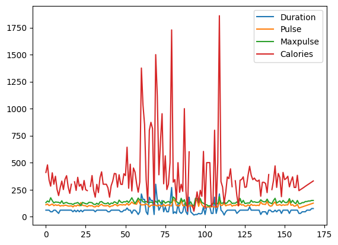

# Learn-DataScience-With-Raheel
Welcome to the 'Learn Data Science with Raheel' repository! This repository is designed to help you embark on a journey to master the art of data science. Whether you're a beginner or looking to enhance your skills, you'll find a collection of resources designed by Raheel to guide you through the world of data science."

# **Pandas - Simplifying Data Analysis in Python**

Pandas is like your data's best friend in the world of Python programming. Just as you'd rely on a friend to help you understand complex situations, Pandas helps you understand and analyze data.

Imagine Pandas as a toolkit for data management, designed specifically to handle data analysis tasks effectively and efficiently.

**1. What is Pandas?**
   - Pandas is a Python library that simplifies data analysis.
   - It's used to manage and manipulate data.
   - Think of it as a data manager for your Python projects.

**2. Core Concepts**
   - **Series and DataFrame:** Pandas introduces two special data types - Series and DataFrame.
   - **Series:** Imagine this as a single column in a spreadsheet. It holds a sequence of data.
   - **DataFrame:** Picture this as an entire spreadsheet. It's made up of multiple columns (Series) and is perfect for structured data.
   
**3. DataFrame in Detail**
   - A DataFrame is like an Excel sheet storing data.
   - Each column can represent different types of information, like names, products, prices, etc.
   - Rows correspond to individual records, making it easy to organize and analyze data.
   
**4. Flexibility and Similarity**
   - A DataFrame is composed of several Series, each representing a column.
   - You can give names to both columns and rows in a DataFrame.
   - If you've used R's data.frame, DataFrame will feel familiar.

**5. Why Choose Pandas?**
   - It's open-source and high-performance.
   - Ideal for various fields - from academia to finance, retail, statistics, and more.
   - Perfect for handling ordered and unordered time series data, unlabeled data, and various observational or statistical data sets.
   
**6. Benefits of Pandas**
   - **Data Analysis and Management:** Pandas offers functions for analyzing, cleaning, exploring, and manipulating data.
   - **Readable and Relevant:** It can turn messy data into meaningful insights.
   - **Big Data Handling:** Pandas can handle large data sets, making it ideal for statistical analysis.

**7. Pandas' Origins**
   - The name ***"Pandas"*** is a blend of ***"Panel Data"*** and ***"Python Data Analysis."***
   - Created by ***Wes McKinney*** in ***2008*** to simplify data analysis in Python.

**8. Using Pandas**
   - Pandas is widely used across academia, finance, retail, economics, and more.
   - It's your go-to tool for understanding data, drawing conclusions, and making data-driven decisions.

Remember, just as you'd trust your friend's advice, you can trust Pandas to help you navigate the complexities of data analysis in Python!

**Learning Outline:**

**Lecture 1: Introduction to Pandas**

- **Introduction:**
  - What is Pandas and why is it important?
  - Installation and importing Pandas.
  
- **Getting Started:**
  - Creating a Pandas Series and DataFrame.
  - Basic operations on Series and DataFrames.
  - Accessing elements using index and labels.
  
**Lecture 2: Pandas Series and DataFrames**

- **Pandas Series:**
  - Creating Series from lists and arrays.
  - Indexing and slicing in Series.
  - Series attributes and methods.

- **DataFrames:**
  - Creating DataFrames from dictionaries and arrays.
  - Indexing and slicing in DataFrames.
  - DataFrame attributes and methods.
  
**Lecture 3: Reading and Analyzing Data**

- **Reading Data:**
  - Using `pd.read_csv()` to read data from CSV files.
  - Using `pd.read_json()` to read data from JSON files.

- **Analyzing Data:**
  - Basic data exploration using `.head()`, `.tail()`, `.info()`.
  - Using `.describe()` to get statistical summary.
  
**Lecture 4: Cleaning Data**

- **Introduction to Cleaning Data:**
  - Why clean data is crucial for analysis.
  
- **Cleaning Empty Cells:**
  - Identifying and handling missing values.
  - Using `.dropna()` and `.fillna()` methods.
  
- **Cleaning Wrong Format:**
  - Converting data types using `.astype()`.
  
- **Cleaning Wrong Data:**
  - Identifying and handling outliers and incorrect data using conditions.
  
- **Removing Duplicates:**
  - Using `.duplicated()` and `.drop_duplicates()` to handle duplicate data.
  
**Lecture 5: Correlations**

- **Understanding Correlations:**
  - Exploring the relationship between variables.
  - Calculating correlation coefficients using `.corr()` method.

- **Plotting:**
  - Using Pandas' built-in plotting capabilities.
  - Creating basic plots such as line, bar, and scatter plots.
  
<!--   
**Programs for Basic Level:**

1. Create a Pandas Series from a list of temperatures and find the average temperature.
2. Create a DataFrame from a dictionary of student information and display the first 5 rows.
3. Read a CSV file containing sales data and display the summary statistics.
4. Create a DataFrame with missing values and handle them using appropriate methods.
5. Convert a column of dates from string format to datetime format.
6. Identify and remove outliers from a DataFrame column.
7. Read a JSON file with information about countries and display specific details.
8. Create a Pandas Series of exam scores and plot a histogram.
9. Merge two DataFrames based on a common column using `.merge()`.
10. Group a DataFrame by a categorical variable and calculate the mean for each group.

**Programs for Intermediate Level:**

1. Clean a column with currency values and convert them to numerical values.
2. Normalize a DataFrame column by scaling it to a specific range.
3. Clean a column of phone numbers to a standardized format using regular expressions.
4. Remove rows with missing values and outliers based on specific conditions.
5. Create a scatter plot to visualize the relationship between two numerical variables.
6. Plot a bar chart showing the distribution of products in a sales dataset.
7. Calculate and visualize the correlation matrix for numerical variables in a DataFrame.
8. Create a line plot showing the trend in stock prices over time.
9. Group data by a time interval and calculate the sum of values within each interval.
10. Create a stacked bar chart to compare different categories within a dataset.

**Programs for Advanced Level:**

1. Calculate Pearson and Spearman correlation coefficients between multiple variables.
2. Use Seaborn along with Pandas to create a heatmap of correlation matrix.
3. Plot multiple line charts on the same axes to compare trends.
4. Create a scatter plot matrix to visualize pairwise relationships in a DataFrame.
5. Perform hierarchical clustering on a dataset and visualize the dendrogram.
6. Plot a time series with multiple variables and legends.
7. Plot a box plot to visualize the distribution of values in different categories.
8. Create interactive plots using Pandas and Plotly.
9. Use Pandas to prepare data for machine learning tasks such as regression.
10. Perform a pivot table operation to summarize and reshape data.
  -->

## **Lecture 1: Introduction to Pandas**

**Introduction:**
Pandas is like a toolkit that unlocks the potential of data analysis in Python. It's designed to handle data effectively and efficiently, making complex tasks simpler.

**Why Pandas is Important:**
In the world of data analysis, you deal with massive amounts of information. Pandas is your partner in making sense of this data, whether it's for research, business, or decision-making.

**Installation and Importing:**
Before using Pandas, you need to install it. Open your terminal or command prompt and type: `pip install pandas`

Once installed, you can import Pandas in your Python script or Jupyter Notebook using:
```python
import pandas as pd
```

**Getting Started:**
Pandas works with two main data structures: Series and DataFrames.

**Creating a Pandas Series:**
A Series is like a list that's been supercharged. It's a one-dimensional array that can hold various data types.
<!-- 
```python
import pandas as pd

# Creating a Series
temperatures = pd.Series([28.5, 32.0, 26.7, 30.2, 29.1])
print(temperatures)
```

**Creating a Pandas DataFrame:**
Think of a DataFrame as a table in a database or a spreadsheet in Excel. It's a two-dimensional data structure with rows and columns.

```python
# Creating a DataFrame
data = {'Name': ['Alice', 'Bob', 'Charlie', 'David'],
        'Age': [25, 30, 22, 28],
        'Salary': [50000, 60000, 45000, 55000]}

df = pd.DataFrame(data)
print(df)
```

**Basic Operations:**
Pandas makes it easy to manipulate data. You can perform operations on Series and DataFrames just like you would with regular Python lists or arrays.

```python
# Basic operations on Series
temperatures.mean()  # Calculate mean temperature
temperatures.max()   # Find the highest temperature

# Basic operations on DataFrames
df['Age'].sum()      # Sum of ages
df['Salary'].mean()  # Mean salary
```

**Accessing Elements:**
Pandas provides flexible ways to access data using indexing and labels.

```python
# Accessing elements in a Series
print(temperatures[2])         # Accessing by index
print(temperatures.loc[0])     # Accessing by label

# Accessing elements in a DataFrame
print(df['Name'][1])           # Accessing column and then row
print(df.loc[2, 'Salary'])     # Accessing using labels
```

Pandas is like your data's best friend, simplifying complex data manipulation tasks. In the next lectures, we'll dive deeper into Pandas' features and capabilities.  -->


```python
import pandas as pd
```


```python
import pandas as pd

print(pd.__version__)
```

    1.3.4
    


```python
import pandas as pd

# Creating a Series
temperatures = pd.Series([28.5, 32.0, 26.7, 30.2, 29.1])
print(temperatures)

```

    0    28.5
    1    32.0
    2    26.7
    3    30.2
    4    29.1
    dtype: float64
    


```python
# Basic operations on Series
temp_mean = temperatures.mean()  # Calculate mean temperature (sum of total/lenght of number)
temp_max = temperatures.max()   # Find the highest temperature (max number)

print(f"Temperature Mean -> {temp_mean}")
print(f"Temperature Max -> {temp_max}")
```

    Temperature Mean -> 29.3
    Temperature Max -> 32.0
    

**Creating a Pandas DataFrame:**
Think of a DataFrame as a table in a database or a spreadsheet in Excel. It's a two-dimensional data structure with rows and columns. 


```python
import pandas as pd

mydataset = {
  'cars': ["BMW", "Volvo", "Ford"],
  'passings': [3, 7, 2]
}

myvar = pd.DataFrame(mydataset)

print(myvar)
```

        cars  passings
    0    BMW         3
    1  Volvo         7
    2   Ford         2
    


```python
# Creating a DataFrame
data = {'Name': ['Alice', 'Bob', 'Charlie', 'David'],
        'Age': [25, 30, 22, 28],
        'Salary': [50000, 60000, 45000, 55000]}

df = pd.DataFrame(data)
df
# print(df)
```


<div>
<style scoped>
    .dataframe tbody tr th:only-of-type {
        vertical-align: middle;
    }

    .dataframe tbody tr th {
        vertical-align: top;
    }

    .dataframe thead th {
        text-align: right;
    }
</style>
<table border="1" class="dataframe">
  <thead>
    <tr style="text-align: right;">
      <th></th>
      <th>Name</th>
      <th>Age</th>
      <th>Salary</th>
    </tr>
  </thead>
  <tbody>
    <tr>
      <th>0</th>
      <td>Alice</td>
      <td>25</td>
      <td>50000</td>
    </tr>
    <tr>
      <th>1</th>
      <td>Bob</td>
      <td>30</td>
      <td>60000</td>
    </tr>
    <tr>
      <th>2</th>
      <td>Charlie</td>
      <td>22</td>
      <td>45000</td>
    </tr>
    <tr>
      <th>3</th>
      <td>David</td>
      <td>28</td>
      <td>55000</td>
    </tr>
  </tbody>
</table>
</div>


```python
# Basic operations on DataFrames
df['Age'].sum()      # Sum of ages
df['Salary'].mean()  # Mean salary
```


    52500.0


```python
df.head(1) # value of top side
```


<div>
<style scoped>
    .dataframe tbody tr th:only-of-type {
        vertical-align: middle;
    }

    .dataframe tbody tr th {
        vertical-align: top;
    }

    .dataframe thead th {
        text-align: right;
    }
</style>
<table border="1" class="dataframe">
  <thead>
    <tr style="text-align: right;">
      <th></th>
      <th>Name</th>
      <th>Age</th>
      <th>Salary</th>
    </tr>
  </thead>
  <tbody>
    <tr>
      <th>0</th>
      <td>Alice</td>
      <td>25</td>
      <td>50000</td>
    </tr>
  </tbody>
</table>
</div>


```python
df.tail(1) # value of bottom side
```


<div>
<style scoped>
    .dataframe tbody tr th:only-of-type {
        vertical-align: middle;
    }

    .dataframe tbody tr th {
        vertical-align: top;
    }

    .dataframe thead th {
        text-align: right;
    }
</style>
<table border="1" class="dataframe">
  <thead>
    <tr style="text-align: right;">
      <th></th>
      <th>Name</th>
      <th>Age</th>
      <th>Salary</th>
    </tr>
  </thead>
  <tbody>
    <tr>
      <th>3</th>
      <td>David</td>
      <td>28</td>
      <td>55000</td>
    </tr>
  </tbody>
</table>
</div>


```python
import pandas as pd

dic = {
    "Name":["Noman",'Ali','Umair',"Ahmed","Noman",'Ali','Umair',"Ahmed"],
    "Marks":[52,68,97,88,63,74,52,45],
    'num':[123,234,456,234,345,457,123,12]
}

dff = pd.DataFrame(dic)

# print(df)

dff
```


<div>
<style scoped>
    .dataframe tbody tr th:only-of-type {
        vertical-align: middle;
    }

    .dataframe tbody tr th {
        vertical-align: top;
    }

    .dataframe thead th {
        text-align: right;
    }
</style>
<table border="1" class="dataframe">
  <thead>
    <tr style="text-align: right;">
      <th></th>
      <th>Name</th>
      <th>Marks</th>
      <th>num</th>
    </tr>
  </thead>
  <tbody>
    <tr>
      <th>0</th>
      <td>Noman</td>
      <td>52</td>
      <td>123</td>
    </tr>
    <tr>
      <th>1</th>
      <td>Ali</td>
      <td>68</td>
      <td>234</td>
    </tr>
    <tr>
      <th>2</th>
      <td>Umair</td>
      <td>97</td>
      <td>456</td>
    </tr>
    <tr>
      <th>3</th>
      <td>Ahmed</td>
      <td>88</td>
      <td>234</td>
    </tr>
    <tr>
      <th>4</th>
      <td>Noman</td>
      <td>63</td>
      <td>345</td>
    </tr>
    <tr>
      <th>5</th>
      <td>Ali</td>
      <td>74</td>
      <td>457</td>
    </tr>
    <tr>
      <th>6</th>
      <td>Umair</td>
      <td>52</td>
      <td>123</td>
    </tr>
    <tr>
      <th>7</th>
      <td>Ahmed</td>
      <td>45</td>
      <td>12</td>
    </tr>
  </tbody>
</table>
</div>


```python
dff.describe() # describe method is used for calculating some statistical data
```


<div>
<style scoped>
    .dataframe tbody tr th:only-of-type {
        vertical-align: middle;
    }

    .dataframe tbody tr th {
        vertical-align: top;
    }

    .dataframe thead th {
        text-align: right;
    }
</style>
<table border="1" class="dataframe">
  <thead>
    <tr style="text-align: right;">
      <th></th>
      <th>Marks</th>
      <th>num</th>
    </tr>
  </thead>
  <tbody>
    <tr>
      <th>count</th>
      <td>8.000000</td>
      <td>8.000000</td>
    </tr>
    <tr>
      <th>mean</th>
      <td>67.375000</td>
      <td>248.000000</td>
    </tr>
    <tr>
      <th>std</th>
      <td>18.282994</td>
      <td>161.992945</td>
    </tr>
    <tr>
      <th>min</th>
      <td>45.000000</td>
      <td>12.000000</td>
    </tr>
    <tr>
      <th>25%</th>
      <td>52.000000</td>
      <td>123.000000</td>
    </tr>
    <tr>
      <th>50%</th>
      <td>65.500000</td>
      <td>234.000000</td>
    </tr>
    <tr>
      <th>75%</th>
      <td>77.500000</td>
      <td>372.750000</td>
    </tr>
    <tr>
      <th>max</th>
      <td>97.000000</td>
      <td>457.000000</td>
    </tr>
  </tbody>
</table>
</div>


## **Lecture 2: Pandas Series and DataFrames**

**Pandas Series:**
The Pandas Series can be defined as a one-dimensional array that is capable of storing various data types. We can easily convert the list, tuple, and dictionary into series using "series' method. The row labels of series are called the index. A Series cannot contain multiple columns. 
It has the following parameter:

* data: It can be any list, dictionary, or scalar value.
* index: The value of the index should be unique and hashable. It must be of the same length as data. If we do not pass any index, default np.arrange(n) will be used.
* dtype: It refers to the data type of series.
* copy: It is used for copying the data.

**Creating Series from Lists and Arrays:**
A Pandas Series is like a column of data. You can create one from a list or an array.

or

We can create a Series in two ways:

* Create an empty Series
* Create a Series using inputs.


```python
import pandas as pd

# Creating a Series from a list
temperatures = pd.Series([28.5, 32.0, 26.7, 30.2, 29.1])
# temperatures
print(temperatures)
```

    0    28.5
    1    32.0
    2    26.7
    3    30.2
    4    29.1
    dtype: float64
    


```python
print(temperatures[2])         # Accessing by index
print(numbers[1:4])            # Slicing
```

    26.7
    1    20
    2    30
    3    40
    dtype: int32
    


```python
print("temperature size ->",temperatures.size)       # Number of elements
print('temperature mean -> ',temperatures.mean())     # Mean value
print('temperature idxmax ->', temperatures.idxmax())   # Index of the maximum value
```

    temperature size -> 5
    temperature mean ->  29.3
    temperature idxmax -> 1
    


```python
# Creating a Series from an array
import numpy as np
arr = np.array([10, 20, 30, 40, 50])
numbers = pd.Series(arr)
print(numbers)
```

    0    10
    1    20
    2    30
    3    40
    4    50
    dtype: int32
    


```python
import pandas as pd

a = [1, 7, 2]

myvar = pd.Series(a)

# print(myvar)
myvar
```


    0    1
    1    7
    2    2
    dtype: int64


```python
import pandas as pd  
import numpy as np  

info = np.array(['P','a','n','d','a','s'])  

a = pd.Series(info)  

print(a) 
```

    0    P
    1    a
    2    n
    3    d
    4    a
    5    s
    dtype: object
    


```python
import pandas as pd

a = [1, 7, 2]

myvar = pd.Series(a, index = ["x", "y", "z"])

print(myvar)
```

    x    1
    y    7
    z    2
    dtype: int64
    


```python
#import the pandas library   
import pandas as pd   
info = {'x' : 0., 'y' : 1., 'z' : 2.}  
a = pd.Series(info)  
print (a)  
```

    x    0.0
    y    1.0
    z    2.0
    dtype: float64
    


```python
import pandas as pd

calories = {"day1": 420, "day2": 380, "day3": 390}

myvar = pd.Series(calories)

print(myvar)
```

    day1    420
    day2    380
    day3    390
    dtype: int64
    


```python
import pandas as pd  
import numpy as np  

x = pd.Series(4, index=[0, 1, 2, 3])  
print (x)  
```

    0    4
    1    4
    2    4
    3    4
    dtype: int64
    


```python
import pandas as pd

calories = {"day1": 420, "day2": 380, "day3": 390}

myvar = pd.Series(calories, index = ["day1", "day2"])

print(myvar)
```

    day1    420
    day2    380
    dtype: int64
    

**DataFrames:**
Pandas DataFrame is a widely used data structure which works with a two-dimensional array with labeled axes (rows and columns). DataFrame is defined as a standard way to store data that has two different indexes, i.e., **row index** and **column index**. It consists of the following properties:
* The columns can be heterogeneous types like int, bool, and so on.
* It can be seen as a dictionary of Series structure where both the rows and columns are indexed. It is denoted as "columns" in case of columns and "index" in case of rows.


**Creating DataFrames from Dictionaries and Arrays:**
DataFrames are versatile. You can create them from dictionaries, arrays, or other data sources.

**Parameter & Description:**
* **data**: It consists of different forms like ndarray, series, map, constants, lists, array.
* **index**: The Default np.arrange(n) index is used for the row labels if no index is passed.
* **columns**: The default syntax is np.arrange(n) for the column labels. It shows only true if no index is passed.
* **dtype**: It refers to the data type of each column.
* **copy()**: It is used for copying the data.


**Create a DataFrame**

We can create a DataFrame using following ways:

* **dict**
* **Lists**
* **Numpy ndarrrays**
* **Series**


```python
# importing the pandas library  
import pandas as pd  
df = pd.DataFrame()  
print (df)  
```

    Empty DataFrame
    Columns: []
    Index: []
    


```python
# importing the pandas library  
import pandas as pd  
# a list of strings  
x = ['Python', 'Pandas']  
  
# Calling DataFrame constructor on list  
df = pd.DataFrame(x)  
# print(df) 
df
```


<div>
<style scoped>
    .dataframe tbody tr th:only-of-type {
        vertical-align: middle;
    }

    .dataframe tbody tr th {
        vertical-align: top;
    }

    .dataframe thead th {
        text-align: right;
    }
</style>
<table border="1" class="dataframe">
  <thead>
    <tr style="text-align: right;">
      <th></th>
      <th>0</th>
    </tr>
  </thead>
  <tbody>
    <tr>
      <th>0</th>
      <td>Python</td>
    </tr>
    <tr>
      <th>1</th>
      <td>Pandas</td>
    </tr>
  </tbody>
</table>
</div>


```python
# importing the pandas library  
import pandas as pd  
info = {'ID' :[101, 102, 103],'Department' :['B.Sc','B.Tech','M.Tech',]}  
df = pd.DataFrame(info)  
# print (df)  
df
```


<div>
<style scoped>
    .dataframe tbody tr th:only-of-type {
        vertical-align: middle;
    }

    .dataframe tbody tr th {
        vertical-align: top;
    }

    .dataframe thead th {
        text-align: right;
    }
</style>
<table border="1" class="dataframe">
  <thead>
    <tr style="text-align: right;">
      <th></th>
      <th>ID</th>
      <th>Department</th>
    </tr>
  </thead>
  <tbody>
    <tr>
      <th>0</th>
      <td>101</td>
      <td>B.Sc</td>
    </tr>
    <tr>
      <th>1</th>
      <td>102</td>
      <td>B.Tech</td>
    </tr>
    <tr>
      <th>2</th>
      <td>103</td>
      <td>M.Tech</td>
    </tr>
  </tbody>
</table>
</div>


```python
print(df['ID'])
```

    0    101
    1    102
    2    103
    Name: ID, dtype: int64
    


```python
print(df['Department'])
```

    0      B.Sc
    1    B.Tech
    2    M.Tech
    Name: Department, dtype: object
    


```python
# importing the pandas library  
import pandas as pd  
  
info = {'one' : pd.Series([1, 2, 3, 4, 5, 6], index=['a', 'b', 'c', 'd', 'e', 'f']),  
   'two' : pd.Series([1, 2, 3, 4, 5, 6, 7, 8], index=['a', 'b', 'c', 'd', 'e', 'f', 'g', 'h'])}  
  
d1 = pd.DataFrame(info)  
# print (d1)  
d1
```


<div>
<style scoped>
    .dataframe tbody tr th:only-of-type {
        vertical-align: middle;
    }

    .dataframe tbody tr th {
        vertical-align: top;
    }

    .dataframe thead th {
        text-align: right;
    }
</style>
<table border="1" class="dataframe">
  <thead>
    <tr style="text-align: right;">
      <th></th>
      <th>one</th>
      <th>two</th>
    </tr>
  </thead>
  <tbody>
    <tr>
      <th>a</th>
      <td>1.0</td>
      <td>1</td>
    </tr>
    <tr>
      <th>b</th>
      <td>2.0</td>
      <td>2</td>
    </tr>
    <tr>
      <th>c</th>
      <td>3.0</td>
      <td>3</td>
    </tr>
    <tr>
      <th>d</th>
      <td>4.0</td>
      <td>4</td>
    </tr>
    <tr>
      <th>e</th>
      <td>5.0</td>
      <td>5</td>
    </tr>
    <tr>
      <th>f</th>
      <td>6.0</td>
      <td>6</td>
    </tr>
    <tr>
      <th>g</th>
      <td>NaN</td>
      <td>7</td>
    </tr>
    <tr>
      <th>h</th>
      <td>NaN</td>
      <td>8</td>
    </tr>
  </tbody>
</table>
</div>


```python
# importing the pandas library  
import pandas as pd  
  
info = {'one' : pd.Series([1, 2, 3, 4, 5, 6], index=['a', 'b', 'c', 'd', 'e', 'f']),  
   'two' : pd.Series([1, 2, 3, 4, 5, 6, 7, 8], index=['a', 'b', 'c', 'd', 'e', 'f', 'g', 'h'])}  
  
d1 = pd.DataFrame(info)
d1
```


<div>
<style scoped>
    .dataframe tbody tr th:only-of-type {
        vertical-align: middle;
    }

    .dataframe tbody tr th {
        vertical-align: top;
    }

    .dataframe thead th {
        text-align: right;
    }
</style>
<table border="1" class="dataframe">
  <thead>
    <tr style="text-align: right;">
      <th></th>
      <th>one</th>
      <th>two</th>
    </tr>
  </thead>
  <tbody>
    <tr>
      <th>a</th>
      <td>1.0</td>
      <td>1</td>
    </tr>
    <tr>
      <th>b</th>
      <td>2.0</td>
      <td>2</td>
    </tr>
    <tr>
      <th>c</th>
      <td>3.0</td>
      <td>3</td>
    </tr>
    <tr>
      <th>d</th>
      <td>4.0</td>
      <td>4</td>
    </tr>
    <tr>
      <th>e</th>
      <td>5.0</td>
      <td>5</td>
    </tr>
    <tr>
      <th>f</th>
      <td>6.0</td>
      <td>6</td>
    </tr>
    <tr>
      <th>g</th>
      <td>NaN</td>
      <td>7</td>
    </tr>
    <tr>
      <th>h</th>
      <td>NaN</td>
      <td>8</td>
    </tr>
  </tbody>
</table>
</div>


```python
print(d1.isnull().sum())       # Count of missing values in each column

```

    one    2
    two    0
    dtype: int64
    


```python
print(d1['one'])
```

    a    1.0
    b    2.0
    c    3.0
    d    4.0
    e    5.0
    f    6.0
    g    NaN
    h    NaN
    Name: one, dtype: float64
    


```python
print(d1['two'])
```

    a    1
    b    2
    c    3
    d    4
    e    5
    f    6
    g    7
    h    8
    Name: two, dtype: int64
    


```python
import pandas as pd

data = {
  "calories": [420, 380, 390],
  "duration": [50, 40, 45]
}

myvar = pd.DataFrame(data)

# print(myvar)
myvar
```


<div>
<style scoped>
    .dataframe tbody tr th:only-of-type {
        vertical-align: middle;
    }

    .dataframe tbody tr th {
        vertical-align: top;
    }

    .dataframe thead th {
        text-align: right;
    }
</style>
<table border="1" class="dataframe">
  <thead>
    <tr style="text-align: right;">
      <th></th>
      <th>calories</th>
      <th>duration</th>
    </tr>
  </thead>
  <tbody>
    <tr>
      <th>0</th>
      <td>420</td>
      <td>50</td>
    </tr>
    <tr>
      <th>1</th>
      <td>380</td>
      <td>40</td>
    </tr>
    <tr>
      <th>2</th>
      <td>390</td>
      <td>45</td>
    </tr>
  </tbody>
</table>
</div>


```python
import pandas as pd

data = {
  "calories": [420, 380, 390],
  "duration": [50, 40, 45]
}

#load data into a DataFrame object:
dff = pd.DataFrame(data)

# print(dff)
dff
```


<div>
<style scoped>
    .dataframe tbody tr th:only-of-type {
        vertical-align: middle;
    }

    .dataframe tbody tr th {
        vertical-align: top;
    }

    .dataframe thead th {
        text-align: right;
    }
</style>
<table border="1" class="dataframe">
  <thead>
    <tr style="text-align: right;">
      <th></th>
      <th>calories</th>
      <th>duration</th>
    </tr>
  </thead>
  <tbody>
    <tr>
      <th>0</th>
      <td>420</td>
      <td>50</td>
    </tr>
    <tr>
      <th>1</th>
      <td>380</td>
      <td>40</td>
    </tr>
    <tr>
      <th>2</th>
      <td>390</td>
      <td>45</td>
    </tr>
  </tbody>
</table>
</div>


```python
print(dff['calories'])
```

    0    420
    1    380
    2    390
    Name: calories, dtype: int64
    


```python
print(dff['duration'])
```

    0    50
    1    40
    2    45
    Name: duration, dtype: int64
    


```python
# Creating a DataFrame from a dictionary
import pandas as pd
data = {'Name': ['Alice', 'Bob', 'Charlie'],
        'Age': [25, 30, 22]}
df = pd.DataFrame(data)
df
```


<div>
<style scoped>
    .dataframe tbody tr th:only-of-type {
        vertical-align: middle;
    }

    .dataframe tbody tr th {
        vertical-align: top;
    }

    .dataframe thead th {
        text-align: right;
    }
</style>
<table border="1" class="dataframe">
  <thead>
    <tr style="text-align: right;">
      <th></th>
      <th>Name</th>
      <th>Age</th>
    </tr>
  </thead>
  <tbody>
    <tr>
      <th>0</th>
      <td>Alice</td>
      <td>25</td>
    </tr>
    <tr>
      <th>1</th>
      <td>Bob</td>
      <td>30</td>
    </tr>
    <tr>
      <th>2</th>
      <td>Charlie</td>
      <td>22</td>
    </tr>
  </tbody>
</table>
</div>


```python
print(df['Name'])              # Accessing a column
```

    0      Alice
    1        Bob
    2    Charlie
    Name: Name, dtype: object
    


```python
print(df['Age'])
```

    0    25
    1    30
    2    22
    Name: Age, dtype: int64
    


```python
print(df['Name'])              # Accessing a column
print()
print(df.loc[2])               # Accessing a row using label
```

    0      Alice
    1        Bob
    2    Charlie
    Name: Name, dtype: object
    
    Name    Charlie
    Age          22
    Name: 2, dtype: object
    


```python
print(df.shape)                # Number of rows and columns
print(df.describe())           # Summary statistics

```

    (3, 2)
                 Age
    count   3.000000
    mean   25.666667
    std     4.041452
    min    22.000000
    25%    23.500000
    50%    25.000000
    75%    27.500000
    max    30.000000
    Name    0
    Age     0
    dtype: int64
    


```python
import pandas as pd
# Creating a DataFrame from an array
arr = np.array([[1, 2, 3], [4, 5, 6]])
matrix_df = pd.DataFrame(arr, columns=['A', 'B', 'C'])
matrix_df
```


<div>
<style scoped>
    .dataframe tbody tr th:only-of-type {
        vertical-align: middle;
    }

    .dataframe tbody tr th {
        vertical-align: top;
    }

    .dataframe thead th {
        text-align: right;
    }
</style>
<table border="1" class="dataframe">
  <thead>
    <tr style="text-align: right;">
      <th></th>
      <th>A</th>
      <th>B</th>
      <th>C</th>
    </tr>
  </thead>
  <tbody>
    <tr>
      <th>0</th>
      <td>1</td>
      <td>2</td>
      <td>3</td>
    </tr>
    <tr>
      <th>1</th>
      <td>4</td>
      <td>5</td>
      <td>6</td>
    </tr>
  </tbody>
</table>
</div>


```python
print(matrix_df['A'])
```

    0    1
    1    4
    Name: A, dtype: int32
    

## **Lecture 3: Reading and Analyzing Data**

**Reading Data:**

**Using `pd.read_csv()` to Read Data from CSV Files:**
CSV (Comma-Separated Values) files are a popular way to store structured data. You can use the `pd.read_csv()` function to load data from a CSV file into a Pandas DataFrame.


```python
import pandas as pd

view = pd.read_csv("calories.csv")

view
```


<div>
<style scoped>
    .dataframe tbody tr th:only-of-type {
        vertical-align: middle;
    }

    .dataframe tbody tr th {
        vertical-align: top;
    }

    .dataframe thead th {
        text-align: right;
    }
</style>
<table border="1" class="dataframe">
  <thead>
    <tr style="text-align: right;">
      <th></th>
      <th>Unnamed: 0</th>
      <th>calories</th>
      <th>duration</th>
    </tr>
  </thead>
  <tbody>
    <tr>
      <th>0</th>
      <td>0</td>
      <td>420</td>
      <td>50</td>
    </tr>
    <tr>
      <th>1</th>
      <td>1</td>
      <td>380</td>
      <td>40</td>
    </tr>
    <tr>
      <th>2</th>
      <td>2</td>
      <td>390</td>
      <td>45</td>
    </tr>
  </tbody>
</table>
</div>


```python
import pandas as pd

df = pd.read_csv('data.csv')

df
```


<div>
<style scoped>
    .dataframe tbody tr th:only-of-type {
        vertical-align: middle;
    }

    .dataframe tbody tr th {
        vertical-align: top;
    }

    .dataframe thead th {
        text-align: right;
    }
</style>
<table border="1" class="dataframe">
  <thead>
    <tr style="text-align: right;">
      <th></th>
      <th>Duration</th>
      <th>Pulse</th>
      <th>Maxpulse</th>
      <th>Calories</th>
    </tr>
  </thead>
  <tbody>
    <tr>
      <th>0</th>
      <td>60</td>
      <td>110</td>
      <td>130</td>
      <td>409.1</td>
    </tr>
    <tr>
      <th>1</th>
      <td>60</td>
      <td>117</td>
      <td>145</td>
      <td>479.0</td>
    </tr>
    <tr>
      <th>2</th>
      <td>60</td>
      <td>103</td>
      <td>135</td>
      <td>340.0</td>
    </tr>
    <tr>
      <th>3</th>
      <td>45</td>
      <td>109</td>
      <td>175</td>
      <td>282.4</td>
    </tr>
    <tr>
      <th>4</th>
      <td>45</td>
      <td>117</td>
      <td>148</td>
      <td>406.0</td>
    </tr>
    <tr>
      <th>...</th>
      <td>...</td>
      <td>...</td>
      <td>...</td>
      <td>...</td>
    </tr>
    <tr>
      <th>164</th>
      <td>60</td>
      <td>105</td>
      <td>140</td>
      <td>290.8</td>
    </tr>
    <tr>
      <th>165</th>
      <td>60</td>
      <td>110</td>
      <td>145</td>
      <td>300.0</td>
    </tr>
    <tr>
      <th>166</th>
      <td>60</td>
      <td>115</td>
      <td>145</td>
      <td>310.2</td>
    </tr>
    <tr>
      <th>167</th>
      <td>75</td>
      <td>120</td>
      <td>150</td>
      <td>320.4</td>
    </tr>
    <tr>
      <th>168</th>
      <td>75</td>
      <td>125</td>
      <td>150</td>
      <td>330.4</td>
    </tr>
  </tbody>
</table>
<p>169 rows × 4 columns</p>
</div>


```python
print(df.head())
```

       Duration  Pulse  Maxpulse  Calories
    0        60    110       130     409.1
    1        60    117       145     479.0
    2        60    103       135     340.0
    3        45    109       175     282.4
    4        45    117       148     406.0
    


```python
# Display the last few rows of the DataFrame
print(df.tail())
```

         Duration  Pulse  Maxpulse  Calories
    164        60    105       140     290.8
    165        60    110       145     300.0
    166        60    115       145     310.2
    167        75    120       150     320.4
    168        75    125       150     330.4
    


```python
# Display concise summary of the DataFrame
df.info()
```

    <class 'pandas.core.frame.DataFrame'>
    RangeIndex: 169 entries, 0 to 168
    Data columns (total 4 columns):
     #   Column    Non-Null Count  Dtype  
    ---  ------    --------------  -----  
     0   Duration  169 non-null    int64  
     1   Pulse     169 non-null    int64  
     2   Maxpulse  169 non-null    int64  
     3   Calories  164 non-null    float64
    dtypes: float64(1), int64(3)
    memory usage: 5.4 KB
    


```python
import pandas as pd

df = pd.read_csv('data.csv')

# print(df)
df
```


<div>
<style scoped>
    .dataframe tbody tr th:only-of-type {
        vertical-align: middle;
    }

    .dataframe tbody tr th {
        vertical-align: top;
    }

    .dataframe thead th {
        text-align: right;
    }
</style>
<table border="1" class="dataframe">
  <thead>
    <tr style="text-align: right;">
      <th></th>
      <th>Duration</th>
      <th>Pulse</th>
      <th>Maxpulse</th>
      <th>Calories</th>
    </tr>
  </thead>
  <tbody>
    <tr>
      <th>0</th>
      <td>60</td>
      <td>110</td>
      <td>130</td>
      <td>409.1</td>
    </tr>
    <tr>
      <th>1</th>
      <td>60</td>
      <td>117</td>
      <td>145</td>
      <td>479.0</td>
    </tr>
    <tr>
      <th>2</th>
      <td>60</td>
      <td>103</td>
      <td>135</td>
      <td>340.0</td>
    </tr>
    <tr>
      <th>3</th>
      <td>45</td>
      <td>109</td>
      <td>175</td>
      <td>282.4</td>
    </tr>
    <tr>
      <th>4</th>
      <td>45</td>
      <td>117</td>
      <td>148</td>
      <td>406.0</td>
    </tr>
    <tr>
      <th>...</th>
      <td>...</td>
      <td>...</td>
      <td>...</td>
      <td>...</td>
    </tr>
    <tr>
      <th>164</th>
      <td>60</td>
      <td>105</td>
      <td>140</td>
      <td>290.8</td>
    </tr>
    <tr>
      <th>165</th>
      <td>60</td>
      <td>110</td>
      <td>145</td>
      <td>300.0</td>
    </tr>
    <tr>
      <th>166</th>
      <td>60</td>
      <td>115</td>
      <td>145</td>
      <td>310.2</td>
    </tr>
    <tr>
      <th>167</th>
      <td>75</td>
      <td>120</td>
      <td>150</td>
      <td>320.4</td>
    </tr>
    <tr>
      <th>168</th>
      <td>75</td>
      <td>125</td>
      <td>150</td>
      <td>330.4</td>
    </tr>
  </tbody>
</table>
<p>169 rows × 4 columns</p>
</div>


```python
import pandas as pd

print(pd.options.display.max_rows) 
```

    60
    


```python
import pandas as pd

pd.options.display.max_rows = 8
df = pd.read_csv('data.csv')

# print(df) 
df

```


<div>
<style scoped>
    .dataframe tbody tr th:only-of-type {
        vertical-align: middle;
    }

    .dataframe tbody tr th {
        vertical-align: top;
    }

    .dataframe thead th {
        text-align: right;
    }
</style>
<table border="1" class="dataframe">
  <thead>
    <tr style="text-align: right;">
      <th></th>
      <th>Duration</th>
      <th>Pulse</th>
      <th>Maxpulse</th>
      <th>Calories</th>
    </tr>
  </thead>
  <tbody>
    <tr>
      <th>0</th>
      <td>60</td>
      <td>110</td>
      <td>130</td>
      <td>409.1</td>
    </tr>
    <tr>
      <th>1</th>
      <td>60</td>
      <td>117</td>
      <td>145</td>
      <td>479.0</td>
    </tr>
    <tr>
      <th>2</th>
      <td>60</td>
      <td>103</td>
      <td>135</td>
      <td>340.0</td>
    </tr>
    <tr>
      <th>3</th>
      <td>45</td>
      <td>109</td>
      <td>175</td>
      <td>282.4</td>
    </tr>
    <tr>
      <th>...</th>
      <td>...</td>
      <td>...</td>
      <td>...</td>
      <td>...</td>
    </tr>
    <tr>
      <th>165</th>
      <td>60</td>
      <td>110</td>
      <td>145</td>
      <td>300.0</td>
    </tr>
    <tr>
      <th>166</th>
      <td>60</td>
      <td>115</td>
      <td>145</td>
      <td>310.2</td>
    </tr>
    <tr>
      <th>167</th>
      <td>75</td>
      <td>120</td>
      <td>150</td>
      <td>320.4</td>
    </tr>
    <tr>
      <th>168</th>
      <td>75</td>
      <td>125</td>
      <td>150</td>
      <td>330.4</td>
    </tr>
  </tbody>
</table>
<p>169 rows × 4 columns</p>
</div>


**Pandas Read JSON**

**Read JSON**

Big data sets are often stored, or extracted as JSON.

JSON is plain text, but has the format of an object, and is well known in the world of programming, including Pandas.


```python
import pandas as pd

# Reading data from a JSON file
data_json = pd.read_json('data.json')

# Displaying the first few rows
print(data_json.head())

```

       Duration  Pulse  Maxpulse  Calories
    0        60    110       130     409.1
    1        60    117       145     479.0
    2        60    103       135     340.0
    3        45    109       175     282.4
    4        45    117       148     406.0
    


```python
import pandas as pd

dic = {
    "Name":["Noman",'Ali','Umair',"Ahmed","Noman",'Ali','Umair',"Ahmed"],
    "Marks":[52,68,97,88,63,74,52,45],
    'num':[123,234,456,234,345,457,123,12]
}

datafra = pd.DataFrame(dic)

datafra
```


<div>
<style scoped>
    .dataframe tbody tr th:only-of-type {
        vertical-align: middle;
    }

    .dataframe tbody tr th {
        vertical-align: top;
    }

    .dataframe thead th {
        text-align: right;
    }
</style>
<table border="1" class="dataframe">
  <thead>
    <tr style="text-align: right;">
      <th></th>
      <th>Name</th>
      <th>Marks</th>
      <th>num</th>
    </tr>
  </thead>
  <tbody>
    <tr>
      <th>0</th>
      <td>Noman</td>
      <td>52</td>
      <td>123</td>
    </tr>
    <tr>
      <th>1</th>
      <td>Ali</td>
      <td>68</td>
      <td>234</td>
    </tr>
    <tr>
      <th>2</th>
      <td>Umair</td>
      <td>97</td>
      <td>456</td>
    </tr>
    <tr>
      <th>3</th>
      <td>Ahmed</td>
      <td>88</td>
      <td>234</td>
    </tr>
    <tr>
      <th>4</th>
      <td>Noman</td>
      <td>63</td>
      <td>345</td>
    </tr>
    <tr>
      <th>5</th>
      <td>Ali</td>
      <td>74</td>
      <td>457</td>
    </tr>
    <tr>
      <th>6</th>
      <td>Umair</td>
      <td>52</td>
      <td>123</td>
    </tr>
    <tr>
      <th>7</th>
      <td>Ahmed</td>
      <td>45</td>
      <td>12</td>
    </tr>
  </tbody>
</table>
</div>


```python
import pandas as pd

save2 = datafra.to_json('marks.json') # make json file
```


```python
import pandas as pd

df = pd.read_json('marks.json')

# print(df.to_string())
df
```


<div>
<style scoped>
    .dataframe tbody tr th:only-of-type {
        vertical-align: middle;
    }

    .dataframe tbody tr th {
        vertical-align: top;
    }

    .dataframe thead th {
        text-align: right;
    }
</style>
<table border="1" class="dataframe">
  <thead>
    <tr style="text-align: right;">
      <th></th>
      <th>Name</th>
      <th>Marks</th>
      <th>num</th>
    </tr>
  </thead>
  <tbody>
    <tr>
      <th>0</th>
      <td>Noman</td>
      <td>52</td>
      <td>123</td>
    </tr>
    <tr>
      <th>1</th>
      <td>Ali</td>
      <td>68</td>
      <td>234</td>
    </tr>
    <tr>
      <th>2</th>
      <td>Umair</td>
      <td>97</td>
      <td>456</td>
    </tr>
    <tr>
      <th>3</th>
      <td>Ahmed</td>
      <td>88</td>
      <td>234</td>
    </tr>
    <tr>
      <th>4</th>
      <td>Noman</td>
      <td>63</td>
      <td>345</td>
    </tr>
    <tr>
      <th>5</th>
      <td>Ali</td>
      <td>74</td>
      <td>457</td>
    </tr>
    <tr>
      <th>6</th>
      <td>Umair</td>
      <td>52</td>
      <td>123</td>
    </tr>
    <tr>
      <th>7</th>
      <td>Ahmed</td>
      <td>45</td>
      <td>12</td>
    </tr>
  </tbody>
</table>
</div>


**Pandas - Analyzing DataFrames**

**Viewing the Data**

One of the most used method for getting a quick overview of the DataFrame, is the head() method.

The head() method returns the headers and a specified number of rows, starting from the top.


```python
import pandas as pd

df = pd.read_csv('data.csv')

# print(df.head(10))

df.head(5)
```


<div>
<style scoped>
    .dataframe tbody tr th:only-of-type {
        vertical-align: middle;
    }

    .dataframe tbody tr th {
        vertical-align: top;
    }

    .dataframe thead th {
        text-align: right;
    }
</style>
<table border="1" class="dataframe">
  <thead>
    <tr style="text-align: right;">
      <th></th>
      <th>Duration</th>
      <th>Pulse</th>
      <th>Maxpulse</th>
      <th>Calories</th>
    </tr>
  </thead>
  <tbody>
    <tr>
      <th>0</th>
      <td>60</td>
      <td>110</td>
      <td>130</td>
      <td>409.1</td>
    </tr>
    <tr>
      <th>1</th>
      <td>60</td>
      <td>117</td>
      <td>145</td>
      <td>479.0</td>
    </tr>
    <tr>
      <th>2</th>
      <td>60</td>
      <td>103</td>
      <td>135</td>
      <td>340.0</td>
    </tr>
    <tr>
      <th>3</th>
      <td>45</td>
      <td>109</td>
      <td>175</td>
      <td>282.4</td>
    </tr>
    <tr>
      <th>4</th>
      <td>45</td>
      <td>117</td>
      <td>148</td>
      <td>406.0</td>
    </tr>
  </tbody>
</table>
</div>


```python
import pandas as pd

df = pd.read_csv('data.csv')

print(df.head())
```

       Duration  Pulse  Maxpulse  Calories
    0        60    110       130     409.1
    1        60    117       145     479.0
    2        60    103       135     340.0
    3        45    109       175     282.4
    4        45    117       148     406.0
    


```python
print(df.tail()) # last 5 rows
```

         Duration  Pulse  Maxpulse  Calories
    164        60    105       140     290.8
    165        60    110       145     300.0
    166        60    115       145     310.2
    167        75    120       150     320.4
    168        75    125       150     330.4
    


```python
# The DataFrames object has a method called info(), 
# that gives you more information about the data set.
print(df.info()) 
```

    <class 'pandas.core.frame.DataFrame'>
    RangeIndex: 169 entries, 0 to 168
    Data columns (total 4 columns):
     #   Column    Non-Null Count  Dtype  
    ---  ------    --------------  -----  
     0   Duration  169 non-null    int64  
     1   Pulse     169 non-null    int64  
     2   Maxpulse  169 non-null    int64  
     3   Calories  164 non-null    float64
    dtypes: float64(1), int64(3)
    memory usage: 5.4 KB
    None
    

## **Lecture 4: Cleaning Data**

**Introduction to Cleaning Data:**
Data analysis begins with clean data. Messy, incomplete, or incorrect data can lead to faulty conclusions. Cleaning data ensures accuracy and reliability.

**Cleaning Empty Cells:**
Missing values are common in real-world datasets. Handling them is crucial for accurate analysis.

**Identifying and Handling Missing Values:**
Pandas uses `NaN` (Not a Number) to represent missing values.

***Example Dataset:***
<pre>
      Duration          Date  Pulse  Maxpulse  Calories
  0         60  '2020/12/01'    110       130     409.1
  1         60  '2020/12/02'    117       145     479.0
  2         60  '2020/12/03'    103       135     340.0
  3         45  '2020/12/04'    109       175     282.4
  4         45  '2020/12/05'    117       148     406.0
  5         60  '2020/12/06'    102       127     300.0
  6         60  '2020/12/07'    110       136     374.0
  7        450  '2020/12/08'    104       134     253.3
  8         30  '2020/12/09'    109       133     195.1
  9         60  '2020/12/10'     98       124     269.0
  10        60  '2020/12/11'    103       147     329.3
  11        60  '2020/12/12'    100       120     250.7
  12        60  '2020/12/12'    100       120     250.7
  13        60  '2020/12/13'    106       128     345.3
  14        60  '2020/12/14'    104       132     379.3
  15        60  '2020/12/15'     98       123     275.0
  16        60  '2020/12/16'     98       120     215.2
  17        60  '2020/12/17'    100       120     300.0
  18        45  '2020/12/18'     90       112       NaN
  19        60  '2020/12/19'    103       123     323.0
  20        45  '2020/12/20'     97       125     243.0
  21        60  '2020/12/21'    108       131     364.2
  22        45           NaN    100       119     282.0
  23        60  '2020/12/23'    130       101     300.0
  24        45  '2020/12/24'    105       132     246.0
  25        60  '2020/12/25'    102       126     334.5
  26        60    2020/12/26    100       120     250.0
  27        60  '2020/12/27'     92       118     241.0
  28        60  '2020/12/28'    103       132       NaN
  29        60  '2020/12/29'    100       132     280.0
  30        60  '2020/12/30'    102       129     380.3
  31        60  '2020/12/31'     92       115     243.0
</pre>


**Cleaning Empty Cells**

**Empty Cells:**
Empty cells can potentially give you a wrong result when you analyze data.

**Remove Row:**
One way to deal with empty cells is to remove rows that contain empty cells.
This is usually OK, since data sets can be very big, and removing a few rows will not have a big impact on the result.


```python
import pandas as pd

df = pd.read_csv('dataa.csv')

print(df)

print()
```

        Duration          Date  Pulse  Maxpulse
    0       60.0           NaN  110.0     130.0
    1       60.0  '2020/12/02'  117.0     145.0
    2       60.0  '2020/12/03'    NaN     135.0
    3       45.0           NaN  109.0       NaN
    4       45.0  '2020/12/05'  117.0     148.0
    ..       ...           ...    ...       ...
    27      60.0  '2020/12/27'   92.0     118.0
    28      60.0           NaN  103.0     132.0
    29       NaN           NaN  100.0     132.0
    30      60.0           NaN  102.0       NaN
    31       NaN  '2020/12/31'   92.0       NaN
    
    [32 rows x 4 columns]
    
    


```python
import pandas as pd

df = pd.read_csv('dataa.csv')

new_df = df.dropna() # dropna remove all the row who consits NAN value in any column

print(new_df.head(7))

```

        Duration          Date  Pulse  Maxpulse
    1       60.0  '2020/12/02'  117.0     145.0
    4       45.0  '2020/12/05'  117.0     148.0
    6       60.0  '2020/12/07'  110.0     136.0
    7      450.0  '2020/12/08'  104.0     134.0
    12      60.0  '2020/12/12'  100.0     120.0
    15      60.0  '2020/12/15'   98.0     123.0
    17      60.0  '2020/12/17'  100.0     120.0
    


```python
import pandas as pd

df = pd.read_csv('dataa.csv')

# print("****************************************************")
# print(df)

# print("****************************************************")
# drp = df.dropna(inplace = True)
# print(drp)

df.dropna(inplace=True)

print(df.to_string())

# df.to_string()
```

        Duration          Date  Pulse  Maxpulse
    1       60.0  '2020/12/02'  117.0     145.0
    4       45.0  '2020/12/05'  117.0     148.0
    6       60.0  '2020/12/07'  110.0     136.0
    7      450.0  '2020/12/08'  104.0     134.0
    12      60.0  '2020/12/12'  100.0     120.0
    15      60.0  '2020/12/15'   98.0     123.0
    17      60.0  '2020/12/17'  100.0     120.0
    18      45.0  '2020/12/18'   90.0     112.0
    19      60.0  '2020/12/19'  103.0     123.0
    20      45.0  '2020/12/20'   97.0     125.0
    24      45.0  '2020/12/24'  105.0     132.0
    27      60.0  '2020/12/27'   92.0     118.0
    

**Replace Empty Values**

Another way of dealing with empty cells is to insert a new value instead.

This way you do not have to delete entire rows just because of some empty cells.

The fillna() method allows us to replace empty cells with a value:


```python
import pandas as pd

reads = pd.read_csv('dataa.csv')

daf = pd.DataFrame(reads)

daf
```


<div>
<style scoped>
    .dataframe tbody tr th:only-of-type {
        vertical-align: middle;
    }

    .dataframe tbody tr th {
        vertical-align: top;
    }

    .dataframe thead th {
        text-align: right;
    }
</style>
<table border="1" class="dataframe">
  <thead>
    <tr style="text-align: right;">
      <th></th>
      <th>Duration</th>
      <th>Date</th>
      <th>Pulse</th>
      <th>Maxpulse</th>
    </tr>
  </thead>
  <tbody>
    <tr>
      <th>0</th>
      <td>60.0</td>
      <td>NaN</td>
      <td>110.0</td>
      <td>130.0</td>
    </tr>
    <tr>
      <th>1</th>
      <td>60.0</td>
      <td>'2020/12/02'</td>
      <td>117.0</td>
      <td>145.0</td>
    </tr>
    <tr>
      <th>2</th>
      <td>60.0</td>
      <td>'2020/12/03'</td>
      <td>NaN</td>
      <td>135.0</td>
    </tr>
    <tr>
      <th>3</th>
      <td>45.0</td>
      <td>NaN</td>
      <td>109.0</td>
      <td>NaN</td>
    </tr>
    <tr>
      <th>...</th>
      <td>...</td>
      <td>...</td>
      <td>...</td>
      <td>...</td>
    </tr>
    <tr>
      <th>28</th>
      <td>60.0</td>
      <td>NaN</td>
      <td>103.0</td>
      <td>132.0</td>
    </tr>
    <tr>
      <th>29</th>
      <td>NaN</td>
      <td>NaN</td>
      <td>100.0</td>
      <td>132.0</td>
    </tr>
    <tr>
      <th>30</th>
      <td>60.0</td>
      <td>NaN</td>
      <td>102.0</td>
      <td>NaN</td>
    </tr>
    <tr>
      <th>31</th>
      <td>NaN</td>
      <td>'2020/12/31'</td>
      <td>92.0</td>
      <td>NaN</td>
    </tr>
  </tbody>
</table>
<p>32 rows × 4 columns</p>
</div>


```python
import pandas as pd

df = pd.read_csv('dataa.csv')

df.fillna(0, inplace = True) # fillna will replace all NAN value into 0
df
```


<div>
<style scoped>
    .dataframe tbody tr th:only-of-type {
        vertical-align: middle;
    }

    .dataframe tbody tr th {
        vertical-align: top;
    }

    .dataframe thead th {
        text-align: right;
    }
</style>
<table border="1" class="dataframe">
  <thead>
    <tr style="text-align: right;">
      <th></th>
      <th>Duration</th>
      <th>Date</th>
      <th>Pulse</th>
      <th>Maxpulse</th>
    </tr>
  </thead>
  <tbody>
    <tr>
      <th>0</th>
      <td>60.0</td>
      <td>0</td>
      <td>110.0</td>
      <td>130.0</td>
    </tr>
    <tr>
      <th>1</th>
      <td>60.0</td>
      <td>'2020/12/02'</td>
      <td>117.0</td>
      <td>145.0</td>
    </tr>
    <tr>
      <th>2</th>
      <td>60.0</td>
      <td>'2020/12/03'</td>
      <td>0.0</td>
      <td>135.0</td>
    </tr>
    <tr>
      <th>3</th>
      <td>45.0</td>
      <td>0</td>
      <td>109.0</td>
      <td>0.0</td>
    </tr>
    <tr>
      <th>...</th>
      <td>...</td>
      <td>...</td>
      <td>...</td>
      <td>...</td>
    </tr>
    <tr>
      <th>28</th>
      <td>60.0</td>
      <td>0</td>
      <td>103.0</td>
      <td>132.0</td>
    </tr>
    <tr>
      <th>29</th>
      <td>0.0</td>
      <td>0</td>
      <td>100.0</td>
      <td>132.0</td>
    </tr>
    <tr>
      <th>30</th>
      <td>60.0</td>
      <td>0</td>
      <td>102.0</td>
      <td>0.0</td>
    </tr>
    <tr>
      <th>31</th>
      <td>0.0</td>
      <td>'2020/12/31'</td>
      <td>92.0</td>
      <td>0.0</td>
    </tr>
  </tbody>
</table>
<p>32 rows × 4 columns</p>
</div>


**Replace Only For Specified Columns**

The example above replaces all empty cells in the whole Data Frame.

To only replace empty values for one column, specify the column name for the DataFrame:


```python
import pandas as pd

df = pd.read_csv('dataa.csv')

# Replace NULL values in the "Calories" columns with the number 130:
df["Maxpulse"].fillna(0, inplace = True)
df["Pulse"].fillna(0, inplace = True)
df.head(7)
```


<div>
<style scoped>
    .dataframe tbody tr th:only-of-type {
        vertical-align: middle;
    }

    .dataframe tbody tr th {
        vertical-align: top;
    }

    .dataframe thead th {
        text-align: right;
    }
</style>
<table border="1" class="dataframe">
  <thead>
    <tr style="text-align: right;">
      <th></th>
      <th>Duration</th>
      <th>Date</th>
      <th>Pulse</th>
      <th>Maxpulse</th>
    </tr>
  </thead>
  <tbody>
    <tr>
      <th>0</th>
      <td>60.0</td>
      <td>NaN</td>
      <td>110.0</td>
      <td>130.0</td>
    </tr>
    <tr>
      <th>1</th>
      <td>60.0</td>
      <td>'2020/12/02'</td>
      <td>117.0</td>
      <td>145.0</td>
    </tr>
    <tr>
      <th>2</th>
      <td>60.0</td>
      <td>'2020/12/03'</td>
      <td>0.0</td>
      <td>135.0</td>
    </tr>
    <tr>
      <th>3</th>
      <td>45.0</td>
      <td>NaN</td>
      <td>109.0</td>
      <td>0.0</td>
    </tr>
    <tr>
      <th>4</th>
      <td>45.0</td>
      <td>'2020/12/05'</td>
      <td>117.0</td>
      <td>148.0</td>
    </tr>
    <tr>
      <th>5</th>
      <td>60.0</td>
      <td>NaN</td>
      <td>102.0</td>
      <td>127.0</td>
    </tr>
    <tr>
      <th>6</th>
      <td>60.0</td>
      <td>'2020/12/07'</td>
      <td>110.0</td>
      <td>136.0</td>
    </tr>
  </tbody>
</table>
</div>


**Removing Duplicates**

Duplicate rows are rows that have been registered more than one time.


```python
import pandas as pd

df = pd.read_csv('dataa.csv')

# Replace NULL values in the "Calories" columns with the number 130:
df["Maxpulse"].fillna(0, inplace = True)
df["Pulse"].fillna(0, inplace = True)

print(df.duplicated())
```

    0     False
    1     False
    2     False
    3     False
          ...  
    28    False
    29    False
    30    False
    31    False
    Length: 32, dtype: bool
    


```python
import pandas as pd

df = pd.read_csv('data2.csv')

df.drop_duplicates(inplace = True)

df
```


<div>
<style scoped>
    .dataframe tbody tr th:only-of-type {
        vertical-align: middle;
    }

    .dataframe tbody tr th {
        vertical-align: top;
    }

    .dataframe thead th {
        text-align: right;
    }
</style>
<table border="1" class="dataframe">
  <thead>
    <tr style="text-align: right;">
      <th></th>
      <th>Duration</th>
      <th>Pulse</th>
      <th>Maxpulse</th>
      <th>Calories</th>
    </tr>
  </thead>
  <tbody>
    <tr>
      <th>0</th>
      <td>0</td>
      <td>117.0</td>
      <td>145</td>
      <td>NaN</td>
    </tr>
    <tr>
      <th>1</th>
      <td>60</td>
      <td>NaN</td>
      <td>135</td>
      <td>340.0</td>
    </tr>
    <tr>
      <th>4</th>
      <td>45</td>
      <td>109.0</td>
      <td>175</td>
      <td>NaN</td>
    </tr>
    <tr>
      <th>5</th>
      <td>45</td>
      <td>NaN</td>
      <td>148</td>
      <td>406.0</td>
    </tr>
    <tr>
      <th>...</th>
      <td>...</td>
      <td>...</td>
      <td>...</td>
      <td>...</td>
    </tr>
    <tr>
      <th>23</th>
      <td>60</td>
      <td>104.0</td>
      <td>132</td>
      <td>NaN</td>
    </tr>
    <tr>
      <th>24</th>
      <td>60</td>
      <td>98.0</td>
      <td>123</td>
      <td>275.0</td>
    </tr>
    <tr>
      <th>25</th>
      <td>60</td>
      <td>98.0</td>
      <td>120</td>
      <td>NaN</td>
    </tr>
    <tr>
      <th>26</th>
      <td>60</td>
      <td>100.0</td>
      <td>120</td>
      <td>300.0</td>
    </tr>
  </tbody>
</table>
<p>18 rows × 4 columns</p>
</div>


## **Lecture 5: Correlations**

**Understanding Correlations:**

**Exploring the Relationship Between Variables:**
Correlation measures the relationship between two variables. It helps you understand if changes in one variable are related to changes in another.

**Calculating Correlation Coefficients using `.corr()` Method:**
Pandas' `.corr()` method calculates the correlation between columns in a DataFrame. It returns a correlation matrix, where each element represents the correlation between two columns.

|| |
| ----- | ----- |
|  |  |
|  | 
 |

 | |


```python
import pandas as pd

df = pd.read_csv('data2.csv')

df.corr()
```


<div>
<style scoped>
    .dataframe tbody tr th:only-of-type {
        vertical-align: middle;
    }

    .dataframe tbody tr th {
        vertical-align: top;
    }

    .dataframe thead th {
        text-align: right;
    }
</style>
<table border="1" class="dataframe">
  <thead>
    <tr style="text-align: right;">
      <th></th>
      <th>Duration</th>
      <th>Pulse</th>
      <th>Maxpulse</th>
      <th>Calories</th>
    </tr>
  </thead>
  <tbody>
    <tr>
      <th>Duration</th>
      <td>1.000000</td>
      <td>-0.690842</td>
      <td>-0.364783</td>
      <td>0.216578</td>
    </tr>
    <tr>
      <th>Pulse</th>
      <td>-0.690842</td>
      <td>1.000000</td>
      <td>0.564717</td>
      <td>0.081403</td>
    </tr>
    <tr>
      <th>Maxpulse</th>
      <td>-0.364783</td>
      <td>0.564717</td>
      <td>1.000000</td>
      <td>0.528012</td>
    </tr>
    <tr>
      <th>Calories</th>
      <td>0.216578</td>
      <td>0.081403</td>
      <td>0.528012</td>
      <td>1.000000</td>
    </tr>
  </tbody>
</table>
</div>


```python
import pandas as pd
import matplotlib.pyplot as plt

df = pd.read_csv('data.csv')

df.plot()

plt.show()
```


    

    


```python

```
